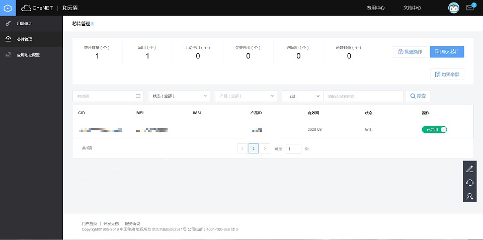

# 服务介绍

## 和云盾能力简介

和云盾为海量物联网终端的安全通信及安全认证提供快速接入服务，通过SE-SIM扩展了SIM卡的高安全性存储及密码运算能力，达到EAL4+金融级硬件安全等级，提升物联网终端的安全防护能力，降低了客户安全方案的成本，为物联网应用提供安全链路加密，可信标识身份认证，芯片生命周期管理，密钥分发/更新服务，敏感数据安全存储能力。

- 低成本

  通过复用SIM载体提供安全能力，减少客户安全投入和硬件改造

- 高安全

  安全芯片硬件载体通过EAL4+认证，提供金融级安全防护能力

- 国密算法         

  支持国密算法，符合国家密码局要求，自主可控

## 主要功能

- 链路加密                    

   使用通信业务密钥对业务数据通信链路进行数据加密，一芯一密，一次一密，防重放攻击，防窃听，保护信息机密性

- 可信标识                    

  提供可信标识存储，不可篡改擦除，支持设备消息的身份认证，有效防止非法设备接入服务

- 生命周期管理           

   支持芯片的生命周期管理，查看芯片生命周期状态，激活和停用芯片安全服务；

- 密钥管理                     

  支持多种密钥体系，实现密钥安全分发，更新，销毁等功能，安全产线实现初始密钥的安全灌装，密钥安全存储在云端加密机及安全芯片中；

- 终端安全                     

  基于安全芯片的高物理安全防护能力，可实现物联网终端敏感数据的安全存储，终端固件的安全校验，实现安全启动和安全升级能力。

## 接入流程

注册OneNET平台号——开启和云盾服务——导入芯片——创建通信套件设备；

## 使用流程

参照平台及终端对接手册进行设备开发——安全上传及下发数据报文