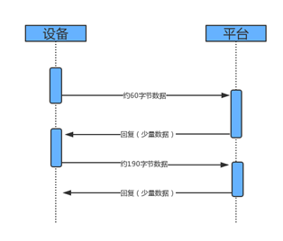
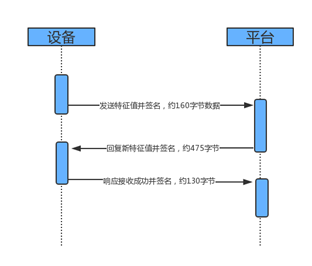
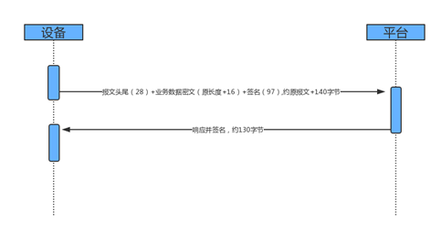
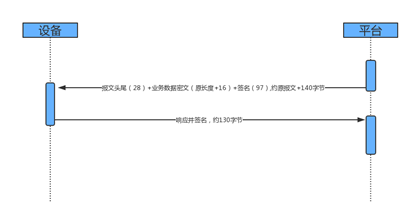
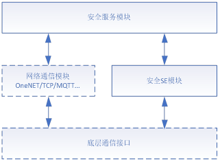

# 和云盾-安全芯片使用说明


## 1. 使用入门

### 1.1 用户资源消耗

- RAM空间占用

  < 3 *KB*

- ROM空间占用

  <11 *KB* (核心功能)

### 1.2 硬件资源消耗

- 硬件接口需求
  - MCU+蜂窝模组+SE-SIM方案：MCU预留串口与模组进行AT指令交互
  - 蜂窝模组（OpenCPU）+ SE-SIM方案：无特殊硬件消耗
  - MCU+SE方案：MCU预留SPI/I2C/ISO7816接口与SE通信

> 蜂窝模组需支持多逻辑通道功能指令（+CGLA,+CCHO,+CCHC）

### 1.3 SDK支持平台

- ARM Cortex-M0/ARM Cortex-M3/ARM Cortex-M4
- Android 5.1+

> 其他平台可根据客户工具链生成

### 1.4 业务传输流量消耗

#### 1.4.1. 非业务流程（低频）

##### A.自注册

**应用场景：**在设备首次连接OneNET时使用，全部生命周期中仅使用一次。

**数据流量消耗：**



##### B.二次发行

**应用场景：**在设备完成芯片注册后发起请求。全部生命周期中仅使用一次。

**数据流量消耗：**



##### C. 密钥更新及下发（低频）

**应用场景：**在需要更新业务密钥时使用，由业务需求确定频率，如可以设置每周、每月等。

**数据流量消耗：**


#### 1.4.2. 业务流程（高频）

##### A. 安全数据上报

**应用场景：**如发送开锁请求

**数据流量消耗：**



##### B. 安全数据下发

**应用场景：**如接收开锁指令

**数据流量消耗：**



### 1.5 安全存储容量

SE提供敏感数据存储，容量约80KB

## 2. 安全业务功能

### 2.1 安全终端的二次发行

通过收集终端上报的设备信息以及厂商自定义数据，由物联网安全服务平台生成设备标识（TID）及对应的设备密钥，并携带业务厂商标识ASD_ID一同加密下发至安全芯片。后续安全终端与业务厂商平台将使用TID以及ASD_ID进行身份认证。

### 2.2 安全终端的密钥更新

设备完成二次发行（将芯片出厂时的预置特征值CID替换成新的设备特征值TID）后，需在业务平台和安全芯片上装载客户的业务密钥，之后的业务交互过程中由对称密钥保证业务交互的数据安全。装载或更新密钥主要包括业务加解密密钥、组播密钥、广播密钥等，根据具体的业务场景进行配置。为了提升安全等级，建议业务系统适时进行密钥更新，避免密钥长久不更换带来的安全隐患。

### 2.3 数据上报

安全终端使用安全芯片中的业务密钥，分散加密得到业务数据密文及签名后上传至业务服务器，业务平台连接安全服务平台验证通过后使用业务密钥分散解密得到原始数据。

### 2.4 数据下载

业务平台使用业务密钥分散，对需要下发的数据进行加密和签名下发至安全终端，终端将密文数据传入安全芯片进行验签和解密还原平台下发的原始数据。

## 3. SE-SIM终端SDK介绍

### 3.1 SE-SIM终端SDK概述

SE-SIM终端SDK中包含安全芯片模块，安全服务通信模块两大大功能。安全芯片模块主要实现了数据加解密签名等密钥运算功能，安全服务通信模块完成了终端与安全服务平台之间安全交互的功能。用户只需参考移植章节，完成对基本接口的移植即可。后续章节将针对每个模块的接口，配置文件进行描述，并提供相应示例代码参考。

逻辑架构图如下：



用户需要在系统启动时调用`CM_SDK_Init()`方法来实现SDK功能模块的初始化。

### **3.2** 安全服务模块

SDK中实现了整个安全服务交互流程的接口，包括终端设备的注册，安全芯片的二次发行，业务密钥的更新，安全数据的上报，安全数据的下载。

用户收到平台下发的数据信息后，将数据传入安全业务接收处理方法，安全SDK将解析该部分报文内容，将数据传入安全芯片解密完成后返回用户。进行安全数据上报时，用户调用安全上报接口，将待上报的业务数据传入API，接口将访问安全芯片对业务数据进行加密上传。整个安全服务流程中具体包含如下接口。

#### 3.2.1 安全业务数据接收处理

该接口用于处理平台下发的安全业务报文，主要涉及到设备注册，芯片二次发行，密钥更新处理，平台下发的安全报文数据。用户在接收到平台下发的数据报文时，需要调用该接口将数据报文传入SDK解析处理。

```c
/**
 * @fn SecurityService_Receive
 * @brief 平台下发安全消息的解析方法，模组收到数据后，将数据传入接口完成数据解析
 * @param[in]  mode     OneNET资源访问模式（READ,WRITE,EXECUTE），如果不使用OneNET则该参数可随意
 * @param[in]  data     平台下发的数据缓存
 * @param[in]  dataLen  平台下发的数据长度
 * @param[out] resp     解析的平台响应（暂未使用）
 * @return     解析成功返回SS_EOK,否则返回ERROR
 * @note 用户可以在模组接收消息的回调方法中，调用该接口将数据传入，完成解析
 * @note data和dataLen均以HEX为基准
**/
uint32_t SecurityService_Receive(uint8_t mode, uint8_t *data, uint32_t dataLen, uint8_t *resp);

```

参数说明：

> mode为OneNET资源访问模式（READ,WRITE,EXECUTE），如果不使用OneNET则该参数可给NULL；
>
> data为平台下发的数据报文缓存；
>
> dataLen为平台下发的数据报文长度；
>
> resp为平台消息解析返回（暂无作用）

调用示例：

```c
static void SecurityServiceTest_Callback(NBIoT_LwM2M_Mode mode, uint32_t msgId, uint8_t *msg)
{
  uint32_t ret;
  uint32_t len;
  if(msg != NULL)
  {
    //取hex长度
	len = strlen(msg)/2;
    //hex转string
	util_str2hex(msg, strlen(msg), msg);
//安全业务接收处理
    ret = SecurityService_Receive(0, msg, len, NULL);
    if((int32_t)ret < 0)
	{
	  check_status = 0;
      rt_kprintf("Data Error\r\n");
      return;
	} 
	else
    {
      check_status = 1;
    }
  }
}
```

#### 3.2.2 设备二次发行请求

该接口用于终端向安全平台发起二次发行请求，终端将收集到的设备信息以及厂商自定义数据上报给物联网安全服务平台，由安全服务平台生成设备标识`TID`及对应的设备密钥，并携带业务厂商标识`ASD_ID`一同加密下发至安全芯片，安全芯片执行成功后将返回`OK`，否则将返回`TIMEOUT`或者`ERROR`错误码。后续安全终端与业务厂商平台将使用`TID`以及`ASD_ID`进行身份认证。注：当卡片已经完成二次发行后，调用该接口将返回`SS_LIFECYCLE_ERROR`生命周期错误。

```c
/**
 * @fn SecurityService_Perso
 * @brief 发起安全服务平台的个人化请求
 * @param[in]  reg    厂商的自定义注册数据（可能包含设备序列号等）
 * @param[in]  len    自定义数据的长度
 * @return      个人化成功返回SS_EOK,失败返回SS_ERROR;
 * @note 完成个人化后，将替换安全芯片中的产线预置密钥，为设备密钥
**/
uint32_t SecurityService_Perso(uint8_t *reg, uint16_t len);
```

参数说明：

> reg为设备的自定义注册信息，若无指定可传入NULL
>
> regLen为设备自定义注册信息的长度

示例代码：

```c

  // 二次发行
  rt_kprintf("Personalization SE\r\n");
  res = SecurityService_Perso(NULL, 0);
  if(res == SS_EOK)
  {
    while(1)
    {
      res = SecurityService_CheckStatus(NULL, NULL);
      if(res == SS_EOK)
      {
         rt_kprintf("Perso Success\r\n");
         break;
      }
      else if(res == SS_TIMEOUT )
      {
        rt_kprintf("Perso Timeout\r\n");
      }
      else if(res == SS_BUSY)
      {
        rt_kprintf("Waiting Data\r\n");
      }
      else
      {
        rt_kprintf("Perso Fail\r\n");
        break;
      }
      Sys_Sleep(1000);
      cnt++;
      if(cnt >= 10)
      {
        res = SS_TIMEOUT;
        break;
      }
   }

```

#### 4.2.3 设备密钥更新请求

该接口用于终端发起业务密钥更新请求，平台接收更新请求后，将验证报文合法性，由平台组织密钥更新报文下发至安全芯片，密钥更新完成后，将返回`OK`，若密钥更新超时返回`TIMEOUT`，更新失败返回`ERROR`。 

```c
/**
 * @fn SecurityService_UpdateKey
 * @brief 发起安全服务更新业务密钥请求
 * @param[in]   无
 * @param[out]  无
 * @return      更新密钥成功返回SS_EOK,失败返回SS_ERROR;
 * @note 
**/
uint32_t SecurityService_UpdateKey(void);
```

示例代码：

```c
// 更新密钥
  rt_kprintf("Update Key\r\n");
  res = SecurityService_UpdateKey();
  if(res == SS_EOK)
  {
    while(1)
    {
      res = SecurityService_CheckStatus(NULL, NULL);
      if(res == SS_EOK)
      {
         rt_kprintf("UpdateKey Success\r\n");
         break;
      }
      else if(res == SS_TIMEOUT )
      {
        rt_kprintf("UpdateKey Timeout\r\n");
      }
      else if(res == SS_BUSY)
      {
        rt_kprintf("Waiting Data\r\n");
      }
      else
      {
        rt_kprintf("UpdateKey Fail\r\n");
        break;
      }
      Sys_Sleep(1000);
      cnt++;
      if(cnt >= 10)
      {
        res = SS_TIMEOUT;
        break;
      }
   }

```

#### 3.2.4 业务数据安全上报

 该接口用于上报用户自定义的业务数据，接口中传入用户的自定义数据和长度，将使用安全芯片加密数据后上报至平台，上报完成后如果平台超时未响应则返回TIMEOUT，成功返回OK。

```c
/**
 * @fn SecurityService_Upload_ NoRsp
 * @brief 安全服务上传安全业务数据
 * @param[in]  data   业务数据
 * @param[in]  len    业务数据长度
 * @param[out]  无
 * @return      上报成功返回SS_EOK,失败返回SS_ERROR;
 * @note 用户传入业务数据后，该接口将计算密文和签名上传至平台
**/
uint32_t SecurityService_Upload_NoRsp(uint8_t *data, uint32_t len);
```

参数说明：

> data为用户的自定义数据；
>
> len为用户的自定义数据长度

示例代码：

```c
uint8_t uploadBuf[10] = {0x11, 0x22, 0x33, 0x44, 0x55, 0x66, 0x77, 0x88, 0x99, 0x00};
//数据上报
res = SecurityService_Upload_NoRsp(uploadBuf, strlen(uploadBuf));
if(res)
{
  rt_kprintf("Upload Error\r\n");
  return;
}
else
{
  rt_kprintf("Upload Success\r\n");
}
```

#### 3.2.5 业务数据接收处理

该接口用于处理平台下发的各类业务数据，与二次发行、密钥更新、数据上报、数据下载接口配合使用。

```c
/**
 * @fn SecurityService_CheckStatus
 * @brief 处理安全业务数据
  * @param[in]   data  返回的数据：只在download时需要给参数，其他业务给NULL
 * @param[in]   dataLen  返回的数据长度：只在download时需要给参数，其他业务给NULL
 * @param[out]  输出明文数据及长度，其他业务无输出
 * @return      处理成功返回SS_EOK,失败返回SS_ERROR;
 * @note
**/
uint32_t SecurityService_CheckStatus(uint8_t *data, uint32_t *dataLen);
```

参数说明：

> data 为平台下发的业务数据缓存，终端完成解密业务数据后，将明文数据填入data缓存，该参数只在数据下载时使用，若为其他业务该字段可传NULL
>
> dataLen为数据长度指针，数据下载业务时需要传入当前缓存的长度，终端完成解密业务数据后，将明文数据长度填入该变量，该参数只在数据下载时使用，若为其他业务该字段可传NULL

### 3.3 安全芯片模块

安全芯片（简称`SE`）模块中包含SE通信抽象层和SE功能实现；SE通信抽象层用于实现终端与`SE`进行`APDU`数据通信的抽象实现，目前支持`ISO7816`与`AT`方式两种接口方式，其中`ISO7816`接口方式提供了硬件和IO模拟的方式。AT指令方式用于与支持多逻辑通道的安全模组通信（支持3GPP逻辑通道部分的功能）。

#### 3.3.1 SE安全功能初始化

该接口用于完成SE安全能力的初始化，通常在进行SE安全功能业务前调用，初始化成功将返回OK，否则返回ERROR;

```c
/**
 * @fn SESecureInit
 * @brief SE安全功能初始化
 * @param[in]   无
 * @param[out]  无
 * @return      初始化成功返回SS_EOK,否则返回SS_ERROR;
 * @note
**/
uint32_t SESecureInit(void);
```

#### 3.3.2 SE安全加密

该接口用于加密一串明文数据，密钥存储在SE中，调用成功后将返回密文数据及长度，否则将返回ERROR;

```c
/**
 * @fn SESecureEncrypt
 * @brief SE加密运算
 * @param[in]   plaintext   明文所在缓存
 * @param[in]   len         明文长度
 * @param[in]   ciphertext  密文所在缓存
 * @param[in]   cipherLen   密文缓存长度
 * @param[out]  无
 * @return      密文长度
 * @note
**/
uint32_t SESecureEncrypt(uint8_t *plaintext, uint32_t len, uint8_t *ciphertext,  uint32_t cipherLen);
```

参数说明：

>plaintext待加密的明文数据缓存；
>
>len待加密的明文长度
>
>ciphertext加密得到的密文数据缓存
>
>cipherLen为密文缓存的大小

示例代码：

```c
	uint8_t plaintext[32] = {0};
	uint8_t ciphertext[32] = {0};
    uint16_t len = 8;
    /// 初始化安全芯片安全功能
    res = SESecureInit();
    if(res != SS_EOK)
    {
        /// 关闭安全芯片功能
        SESecureDeInit();
        return res;
    }
    /// 安全芯片加密数据
    res = SESecureEncrypt(plaintext, len, ciphertext, sizeof(ciphertext));
    if(res == SS_ERROR)
    {
        /// 关闭安全芯片功能
        SESecureDeInit();
        return res;
    }
```

#### 3.3.3 SE安全解密

该接口用于解密密文数据，密钥存储在SE中，调用成功后将返回明文数据及长度，否则将返回ERROR;

```c
/**
 * @fn SESecureDecrypt
 * @brief SE解密运算
 * @param[in]   ciphertext    密文所在缓存
 * @param[in]   len           密文长度
 * @param[in]   plaintext     明文所在缓存
 * @param[in]   plainLen      明文缓存长度
 * @param[out]  无
 * @return      明文长度
 * @note
**/
uint32_t SESecureDecrypt(uint8_t *ciphertext, uint32_t len, uint8_t *plaintext,  uint32_t plainLen);
```

参数说明：

> ciphertext为待解密的密文数据缓存；
>
> len为待解密的密文长度
>
> plaintext为解密得到的明文数据缓存
>
> plainLen为明文数据缓存的长度

示例代码：

```c
	uint8_t plaintext[32] = {0};
	uint8_t ciphertext[32] = {0};
    uint16_t len = 8;
    /// 初始化安全芯片安全功能
    res = SESecureInit();
    if(res != SS_EOK)
    {
        /// 关闭安全芯片功能
        SESecureDeInit();
        return res;
    }
    /// 安全芯片解密数据
    res = SESecureDecrypt(ciphertext, len, plaintext, sizeof(plaintext));
    if(res == SS_ERROR)
    {
        /// 关闭安全芯片功能
        SESecureDeInit();
        return res;
    }
    else{
        len = (uint16_t)res;
        log(plaintext, res);
    }
	/// 关闭安全芯片功能
    SESecureDeInit();
```

#### 3.3.4 获取随机数

该接口可以实现通过SE获取卡片随机数，调用成功后将返回获取的随机数长度，否则返回ERROR

```c
/**
 * @fn SESecureRandom
 * @brief SE获取随机数
 * @param[in]   random        随机数存放缓存
 * @param[in]   len           期望随机数长度
 * @param[out]  无
 * @return      返回的随机数长度，否则返回错误ERROR
 * @note
**/
uint32_t SESecureRandom(uint8_t *random, uint16_t len);

```

参数说明:

> random为获取的随机数的存放缓存
>
> len为期望的随机数获取长度

示例代码：

```c
	uint8_t random[8];
    /// 初始化安全芯片安全功能
    res = SESecureInit();
    if(res != SS_EOK)
    {
        /// 关闭安全芯片功能
        SESecureDeInit();
        return res;
    }
    /// 获取随机数
    res = SESecureRandom(random, 8);
    if(res == SS_ERROR)
    {
        /// 关闭安全芯片功能
        SESecureDeInit();
        return res;
    }
  	SESecureDeInit();

```

#### 3.3.5 安全数据封包处理

该接口可以实现数据的加密和签名，用于安全服务中的业务数据加密上报，用户传入业务数据，由SE完成加密和签名生成封包数据。生成成功后将返回封包数据的真实长度，否则将返回SS_ERROR;

```c
/**
 * @fn SESecureWrap
 * @brief 封包指令，用于加密并签名数据用于上传服务器
 * @param[in]   mode            业务模式（默认为0）
 * @param[in]   input           待封包数据缓存
 * @param[in]   inputLen        待封包数据长度
 * @param[in]   output          封包后的原始数据缓存
 * @param[in]   outputLen		  封包的数据缓存大小
 * @return      执行成功返回封包数据长度，否则返回SS_ERROR;
 * @note
**/
uint32_t SESecureWrap(uint8_t mode, uint8_t *input, uint32_t inputLen, uint8_t *output, uint32_t outputLen);
```

参数说明：

> mode为加密模式，当前默认是0；
>
> input为待加密的数据缓存，该部分为用户数据
>
> inputLen为待加密的数据长度，该部分为用户数据的长度
>
> output为存储封包数据的缓存
>
> outputLen为存储封包数据缓存的长度 

示例代码：

```c
	uint8_t data[8];
	uint8_t outputBuf[256];
    /// 初始化安全芯片安全功能
    res = SESecureInit();
    if(res != SS_EOK)
    {
        /// 关闭安全芯片功能
        SESecureDeInit();
        return res;
    }
    /// 封包数据
    res = SESecureWrap(0, data, 8, outputBuf, 256);
    if(res == SS_ERROR)
    {
        /// 关闭安全芯片功能
        SESecureDeInit();
        return res;
    }
  	SESecureDeInit();
```

#### 3.3.6 安全数据解封处理

该接口可以实现将平台下发的安全业务数据进行签名验证及解密，由SE完成对签名的验证，验证成功后使用业务密钥解密业务数据，解密完成后将数据存储在原始数据缓存中，签名验证失败将返回错误SS_ERROR。

```c
/**
 * @fn SESecureUnWrap
 * @brief 解包指令，用于解密验证服务器下发的数据
 * @param[in]   mode            业务模式
 * @param[in]   input           待解包数据缓存
 * @param[in]   inputLen        待解包数据长度
 * @param[in]   output          解包后的原始数据缓存
 * @param[out]  outputLen		  解包后的数据缓存长度
 * @return      执行成功返回原始数据长度，否则返回SS_ERROR;
 * @note
**/
uint32_t SESecureUnWrap(uint8_t mode, uint8_t *input, uint32_t inputLen, uint8_t *output, uint32_t outputLen);
```

参数说明：

> mode为解密模式，当前默认是0；
>
> input为待解密的平台数据缓存，该部分为平台下发的业务数据
>
> inputLen为待解密的平台数据缓存长度，该部分为平台下发的业务数据的长度
>
> output为存储用户原始数据的缓存 
>
> outputLen为存储用户原始数据的缓存长度 

示例代码：

```c
	uint8_t data[8];
	uint8_t outputBuf[256];
    /// 初始化安全芯片安全功能
    res = SESecureInit();
    if(res != SS_EOK)
    {
        /// 关闭安全芯片功能
        SESecureDeInit();
        return res;
    }
    /// 解包数据
    res = SESecureUnWrap(0, data, 8, outputBuf, 256);
    if(res == SS_ERROR)
    {
        /// 关闭安全芯片功能
        SESecureDeInit();
        return res;
    }
  	SESecureDeInit();

```

#### 3.3.7 获取芯片CID信息

该接口将可以用于获取安全芯片内预置的CID标识，获取成功后将返回CID的长度（10字节），否则返回SS_ERROR；

```c
/**
 * @fn SESecureGetCID
 * @brief 获取SE的CID数据
 * @param[in]   cid           cid缓存
 * @param[in]   len           cid长度
 * @param[out]  null
 * @return      执行成功返回原始数据长度，否则返回SS_ERROR;
 * @note
**/
uint32_t SESecureGetCID(uint8_t *cid, uint16_t len);
```

参数说明：

> cid为用于存储获取CID标识的缓存；
>
> len为用于存放CID标识的缓存大小

示例代码：

```c
uint8_t cid[10];
    /// 初始化安全芯片安全功能
    res = SESecureInit();
    if(res != SS_EOK)
    {
        /// 关闭安全芯片功能
        SESecureDeInit();
        return res;
    }
    /// 获取CID
    res = SESecureGetCID (cid, 10);
    if(res == SS_ERROR)
    {
        /// 关闭安全芯片功能
        SESecureDeInit();
        return res;
    }
  	SESecureDeInit();

```

#### 3.3.8 获取设备的TID标识

该接口用于获取安全芯片完成二次发行后，下发的新的设备标识TID，获取成功后将写入缓存并返回TID的长度（16字节），否则将返回SS_ERROR;

```c
/**
 * @fn SESecureGetTID
 * @brief 获取SE的TID数据
 * @param[in]   tid           tid缓存
 * @param[in]   len           tid长度
 * @param[out]  null
 * @return      执行成功返回原始数据长度，否则返回SS_ERROR;
 * @note
**/
uint32_t SESecureGetTID(uint8_t *tid, uint16_t len);
```

参数说明：

> tid为用于存储获取TID标识的缓存；
>
> len为用于存放TID标识的缓存大小

示例代码：

```c
	uint8_t tid[16];
    /// 初始化安全芯片安全功能
    res = SESecureInit();
    if(res != SS_EOK)
    {
        /// 关闭安全芯片功能
        SESecureDeInit();
        return res;
    }
    /// 获取TID
    res = SESecureGetTID(tid, 16);
    if(res == SS_ERROR)
    {
        /// 关闭安全芯片功能
        SESecureDeInit();
        return res;
    }
  	SESecureDeInit();
```

#### 3.3.9 获取芯片生命周期

该接口可以实现获取安全芯片的生命周期操作，获取成功后将返回SS_EOK，并将生命周期数值写入指针数据。获取失败将返回SS_ERROR。

```c
/**
 * @fn SESecureGetLifecycle
 * @brief 获取卡片的生命周期状态
 * @param[out]  lifecycle     生命周期变量指针 
	1为一次发行（产线初始化）2-二次个人化  3-用户态
 * @return      执行成功返回SS_EOK lifecycle数据将更新，否则返回SS_ERROR;
 * @note
**/
uint32_t SESecureGetLifecycle(uint8_t *lifecycle);
```

参数说明：

> lifecycle为存放生命周期的指针变量
>
> 当为1表明芯片为产品初始化状态需通过二次发行更新状态
>
> 当为2表明芯片为二次发行状态，该状态已经下发了新的设备密钥，由于不存在业务密钥，无法实现安全数据业务；
>
> 当为3表明芯片为用户态，该状态下已下发用户的业务数据密钥，可以进行安全的业务数据交互

示例代码：

```c
	uint8_t lifecycle;
    /// 初始化安全芯片安全功能
    res = SESecureInit();
    if(res != SS_EOK)
    {
        /// 关闭安全芯片功能
        SESecureDeInit();
        return res;
    }
    /// 获取TID
    res = SESecureGetLifecycle(&lifecycle);
    if(res == SS_ERROR)
    {
        /// 关闭安全芯片功能
        SESecureDeInit();
        return res;
    }
```

#### 3.3.10 SE数据签名

该接口可以实现通过SE完成签名操作，目前支持完成SM9的签名计算，支持的签名密钥有CID和TID，签名计算成功后将返回签名数据的长度，否则返回失败SS_ERROR;

```c
/**
 * @fn SESecureSign
 * @brief SE计算签名（SM9,SM2）
 * @param[in]  mode           签名模式（CID_SM9,TID_SM9）
 * @param[in]  input          待签名数据的原文
 * @param[in]  inputLen       待签名数据的长度
 * @param[in]  output         签名结果存放数据缓存
 * @param[in]  outputLen      签名结果存放数据缓存长度
 * @return     签名成功后返回签名数据长度，否则返回失败错误码
 * @note
**/
uint32_t SESecureSign(uint8_t mode, uint8_t *input, uint32_t inputLen, uint8_t *output, uint32_t outputLen);
```

参数说明：

> mode为签名模式，
>
> SIGN_CID_SM9为使用CID密钥进行SM9签名，SIGN_TID_SM9为使用TID密钥进行SM9签名；
>
> input为待签名的数据原文缓存
>
> inputLen为待签名的数据长度
>
> output为签名数据存放的缓存
>
> outputLen为签名数据存放缓存的大小

示例代码：

```c
	uint8_t data[2] = {0};
	uint8_t output[128];
    /// 初始化安全芯片安全功能
    res = SESecureInit();
    if(res != SS_EOK)
    {
        /// 关闭安全芯片功能
        SESecureDeInit();
        return res;
    }
    /// SM9签名
    res = SESecureSign(SIGN_CID_SM9, data, 2, output, sizeof(output));
    if(res == SS_ERROR)
    {
        /// 关闭安全芯片功能
        SESecureDeInit();
        return res;
    }

```

#### 3.3.11 SE数据验签

该接口可以实现使用安全芯片对数据的签名验证操作，目前支持SM9签名验证算法，支持的验签密钥包括CID,TID,CASD,ASD四组。数据签名验证通过后返回SS_EOK，否则返回SS_ERROR;

```c
/**
 * @fn SESecureVerify
 * @brief SE校验签名结果（SM9,SM2）
 * @param[in]  mode           签名模式（CID_SM9,TID_SM9,CASD_SM9,ASD_SM9）
 * @param[in]  input          待签名数据的原文
 * @param[in]  inputLen       待签名数据的长度
 * @param[in]  sign           签名结果数据缓存
 * @param[in]  signLen        签名结果数据长度
 * @return     签名成功返回SS_EOK,否则返回失败错误码
 * @note
**/
uint32_t SESecureVerify(uint8_t mode, uint8_t *input, uint32_t inputLen, uint8_t *sign, uint32_t signLen);
```

参数说明：

> mode为签名模式，
>
> SIGN_CID_SM9为使用CID芯片标识进行SM9验签，
>
> SIGN_TID_SM9为使用TID设备标识进行SM9验签；
>
> SIGN_CASD_SM9为使用CASD安全服务平台标识进行SM9验签；
>
> SIGN_ASD_SM9为使用ASD厂商标识进行SM9验签
>
> input为待验证签名的数据原文缓存
>
> inputLen为待验证签名的数据长度
>
> sign为签名数据缓存
>
> signLen为签名数据长度

示例代码：

```C
	uint8_t data[2] = {0};
	uint8_t sign[97];
    /// 初始化安全芯片安全功能
    res = SESecureInit();
    if(res != SS_EOK)
    {
        /// 关闭安全芯片功能
        SESecureDeInit();
        return res;
    }
    /// SM9签名验证
    res = SESecureVerify(SIGN_CID_SM9, data, 2, sign, 97);
    if(res == SS_ERROR)
    {
        /// 关闭安全芯片功能
        SESecureDeInit();
        return res;
    }
```

#### 3.3.12 SE敏感数据存储

该接口用于实现敏感数据的安全存储功能，用户可以将自定的业务数据存放在芯片的安全区域实现防物理攻击功能，存储成功后将返回SS_EOK，否则返回SS_ERROR;

```c
/**
 * @fn SESecureSave
 * @brief SE敏感数据存储
 * @param[in]   data          敏感数据缓存
 * @param[in]   off           敏感数据存储在SE中的偏移
 * @param[in]   len           敏感数据长度
 * @param[out]  null
 * @return      执行成功返回SS_EOK，否则返回SS_ERROR;
 * @note
**/
uint32_t SESecureSave(uint8_t *data, uint16_t off, uint16_t len);
```

参数说明：

> data为待存储的敏感数据缓存
>
> off为待存储的敏感数据在SE中的偏移
>
> len为待存储的敏感数据的长度

示例代码：

```c
	uint8_t data[2] = {0};
    /// 初始化安全芯片安全功能
    res = SESecureInit();
    if(res != SS_EOK)
    {
        /// 关闭安全芯片功能
        SESecureDeInit();
        return res;
    }
    /// 数据存储
    res = SESecureSave(data, 0, 2);
    if(res == SS_ERROR)
    {
        /// 关闭安全芯片功能
        SESecureDeInit();
        return res;
    }

```

#### 3.3.13 SE敏感数据读取

该接口用于实现读取安全芯片中的敏感数据内容，获取成功将返回SS_EOK，否则返回SS_ERROR;

```c
/**
 * @fn SESecureRead
 * @brief 读取指定偏移的敏感数据
 * @param[in]   data            期望读取的敏感数据存放缓存
 * @param[in]   off             期望读取的数据在SE中的偏移
 * @param[in]   len             期望读取的数据长度
 * @param[out]  null
 * @return      执行成功返回SS_EOK，否则返回SS_ERROR;
 * @note
**/
uint32_t SESecureRead(uint8_t *data, uint16_t off, uint16_t len);
```

参数说明：

> data为待读取的敏感数据存放缓存
>
> off为待读取的敏感数据在SE中的偏移
>
> len为待读取的敏感数据长度

示例代码：

```c
	uint8_t data[128] = {0};
    /// 初始化安全芯片安全功能
    res = SESecureInit();
    if(res != SS_EOK)
    {
        /// 关闭安全芯片功能
        SESecureDeInit();
        return res;
    }
    /// 数据读取
    res = SESecureRead(data, 0, 128);
    if(res == SS_ERROR)
    {
        /// 关闭安全芯片功能
        SESecureDeInit();
        return res;
    }

```

#### 3.3.14 SE安全功能关闭

该接口用于结束当前SE安全功能调用，此时SE将清除上下文信息，一般在安全业务结束后关闭；

```c
/**
 * @fn SESecureDeInit
 * @brief SE功能关闭
 * @param[in]   无
 * @param[out]  无
 * @return      无
 * @note
**/
void SESecureDeInit(void);
```

## 4. 代码移植

终端安全SDK的移植主要包括四个部分：

1. 配置文件的修改；
2. 系统资源接口实现；
3. 与模组通信相关接口的移植；
4. SE通信接口驱动实现（适用于安全芯片与MCU直接通信使用）。

需用户自己实现的文件存放至Porting目录下，用户需要根据自身平台实现文件中文件中的接口函数。目前终端SDK实现了模组与安全芯片的通信接口，针对无法通过模组与安全芯片通信的硬件，SDK中也实现了7816协议的驱动，此时用户还需要移植7816的部分IO驱动。

用户导入SDK库包后，在头文件引用路径中添加SDK/Include路径即可。

### 4.1 硬件平台底层接口移植

#### 4.1.1 系统挂起延时
该接口主要功能是线程挂起延时，如果是无操作系统，可直接实现为延时函数。

```c
/**
 * @fn Sys_Sleep
 * @brief 系统挂起延时
 * @param[in]   ms      延时时间，单位为毫秒
 * @param[out]  null
 * @return      无
 * @note
**/
void Sys_Sleep(uint32_t ms);
```

参数说明：

> ms：挂起/延时时间，以ms为单位

移植示例：

```c
void Sys_Sleep(uint32_t ms)
{
  rt_thread_delay(ms);
}
void Sys_Sleep(uint32_t ms)
{
  HAL_Delay(ms);
}

```

#### 4.1.2 内存分配

该接口主要用于进行内存分配，从Heap中申请内存空间，如果支持标准库可直接调用malloc。

```c
/**
 * @fn Sys_malloc
 * @brief 申请heap空间
 * @param[in]   size      申请内存空间的大小
 * @param[out]  null
 * @return      执行成功返回内存空间地址，否则返回NULL
 * @note
**/
uint8_t *Sys_malloc(uint32_t size);

```

参数说明：

> size：需要申请内存的大小

移植示例：

```c
uint8_t *Sys_malloc(uint32_t size)
{
  return (uint8_t *)rt_malloc(size);
}
uint8_t *Sys_malloc(uint32_t size)
{
  return (uint8_t *)malloc(size);
}

```

#### 4.1.3 内存释放

该接口主要用于进行内存释放，从Heap中释放内存空间，如果支持标准库可直接调用free接口。

```c
/**
 * @fn Sys_free
 * @brief 释放申请的内存空间
 * @param[in]   mem     待释放的内存空间地址
 * @param[out]  null
 * @return      null
 * @note
**/
void Sys_free(uint8_t *mem);

```

参数说明：

> mem：需要释放的内存的指针

移植示例：

```c
void Sys_free(uint8_t *mem)
{
  rt_free((void *)mem);
}
void Sys_free(uint8_t *mem)
{
  free((void *)mem);
}
```

#### 4.1.5 进入临界区

该接口用于操作共享资源时执行的临界区保护动作，通常在RTOS环境下可以关闭系统调度，在前后台的实现中可以关闭系统中断来实现；

```c
/**
 * @fn Sys_enter_critical
 * @brief 进入临界区
 * @param[in]   null
 * @param[out]  null
 * @return      null
 * @note
**/
void Sys_enter_critical();

```

移植示例：

```c
void Sys_enter_critical()
{
  rt_enter_critical();
}
void Sys_enter_critical()
{
  __disable_irq();
}

```

#### 4.1.6 退出临界区

该接口用于释放之前操作共享资源时的临界区保护动作，通常在RTOS环境下可以恢复系统调度，在前后台实现中可以恢复系统中断来实现；

```c
/**
 * @fn Sys_exit_critical
 * @brief 退出临界区
 * @param[in]   null
 * @param[out]  null
 * @return      null
 * @note
**/
void Sys_exit_critical();

```

移植示例：

```c
void Sys_exit_critical()
{
  rt_exit_critical();
}
void Sys_exit_critical()
{
  __enable_irq();
}

```

### 4.2 通信平台接口移植

由于用户的模组及底层驱动实现方式不尽相同，需由用户实现相关的通信移植接口供SDK调用，具体的移植接口函数见Porting/commiot.c。

#### 4.2.1 AT指令收发接口

该接口需要用户完成MCU发送AT指令并接收AT指令返回，SDK将调用该接口实现MCU与模组的AT指令通信，实现安全功能的调用，调用的AT指令包括AT+CCHO、AT+CCHC、AT+CGLA。

```c
/**
 * @fn COMMIoT_ATCmd_Send
 * @brief 向COMM模组发送AT指令
 * @param[in]   cmd						待发送的AT指令
 * @param[in]   expect				期望返回的数据信息
 * @param[in]   timeout				指令等待超时时间
 * @param[out]  resp					AT指令响应返回存储缓存
 * @return      发送成功并且返回数据匹配返回SS_EOK，否则返回SS_ERROR
 * @note
**/
uint32_t COMMIoT_ATCmd_Send(uint8_t *cmd, uint8_t *expect, uint32_t timeout, uint8_t **resp);
```

参数说明：

> cmd：需要发送的AT指令,例如”AT+CCHC=1\r\n“
>
> expect：期望返回的数据信息,例如”OK"
>
> timeout：指令等待超时时间，超过该时间值无数据返回return超时
>
> resp：AT指令响应返回存储缓存，用来存储AT指令的响应数据

#### 4.2.2 IMEI信息获取

该接口需用户实现获取通信模组IMEI，将IMEI存入缓存中。

```c
/**
 * @fn COMMIoT_Device_GetIMEI
 * @brief 获取模组的IMEI信息
 * @param[in]    imei       存放IMEI号的数据缓存，缓存大小需大于15字节
 * @param[out]   无
 * @return       获取成功返回SS_EOK,否则返回SS_ERROR
 * @note
**/
uint32_t COMMIoT_Device_GetIMEI(uint8_t * imei);

```

参数说明：

> imei：存储IMEI的缓存区

移植示例：

```c
uint32_t COMMIoT_Device_GetIMEI(uint8_t * imei)
{
  uint8_t *resp;
  uint8_t *dataPtr;
  uint8_t cnt = 0;
  
  if(nb5310a_sendCmd("AT+CGSN=1\r\n", "OK", 0, &resp))
  {
    return SS_ERROR;
  }
  
  if(resp != NULL)
  {
    dataPtr = (uint8_t *)strchr((char *)resp, ':');
    
    if(dataPtr != NULL)
    {
      dataPtr++;
      
      if(*dataPtr == ' ')
      {
        dataPtr++;
      }
      
      while(*dataPtr >= '0' && *dataPtr <= '9')
      {
        imei[cnt++] = *dataPtr++;
      }
      
      return SS_EOK;
    }
    else
    {
      return SS_ERROR;
    }
  }
  else
  {
    return SS_ERROR;
  }
}
```

#### 4.2.3 IMSI信息获取

该接口需用户实现获取通信模组IMSI号，将IMSI号保存到入参缓存中。

```c
/**
 * @fn COMMIoT_Device_GetIMSI
 * @brief 获取当前使用SIM的IMSI信息
 * @param[in]    imsi       存放IMSI号的数据缓存，缓存大小需大于15字节
 * @param[out]   无
 * @return       获取成功返回SS_EOK,否则返回SS_ERROR
 * @note
**/
uint32_t COMMIoT_Device_GetIMSI(uint8_t * imsi);

```

参数说明：

> imsi：存储IMSI号的缓存区

移植示例：

```c
uint32_t COMMIoT_Device_GetIMSI(uint8_t * imsi)
{
  uint8_t *resp;
  uint8_t *dataPtr;
  uint8_t cnt = 0;
  
  if(nb5310a_sendCmd("AT+CIMI\r\n", "OK", 0, &resp))
  {
    return SS_ERROR;
  }
  
  if(resp != NULL)
  {
  
    dataPtr = resp;
    
    while((!(*dataPtr >= '0' && *dataPtr <= '9')) && (*dataPtr != '\0'))
    {
      dataPtr ++;
    }
    
    if(*dataPtr == '\0')
    {
      return SS_ERROR;
    }
    
    while(*dataPtr >= '0' && *dataPtr <= '9')
    {
      imsi[cnt++] = *dataPtr++;
    }
    
    return SS_EOK;
  }
  else
  {
    return SS_ERROR;
  }
  
}
```

#### 4.2.4 网络数据发送接口

该接口需要用户实现发送网络数据的功能，例如通过NB模组向OneNET平台推送数据可发送AT+MIPLNOTIFY指令,其他通信协议可参见模组说明手册。

```c
/**
 * @fn COMMIoT_NetData_Send
 * @brief 网络数据发送接口
 * @param[in]   data  要发送的数据
 * @param[in]   len  要发送的数据的数据长度
 * @param[out]  无
 * @return      发送成功返回SS_EOK，发送失败返回相应的失败信息
 * @note data和len均以HEX为基准，如需以其他格式发送则在该接口中要实现数据转换
**/
uint32_t COMMIoT_NetData_Send(uint8_t *data, uint32_t len);

```

参数说明：

> data为需要发送的数据缓存
>
> len为需要发送是的数据缓存长度

