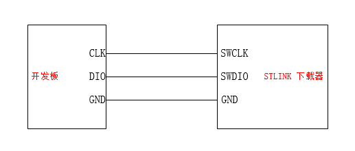
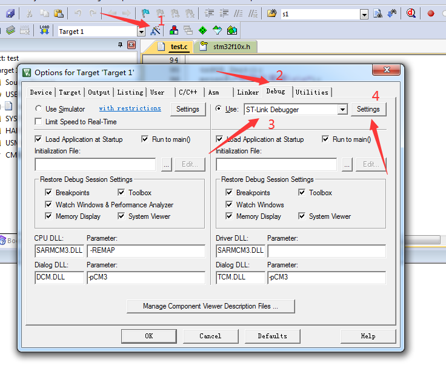
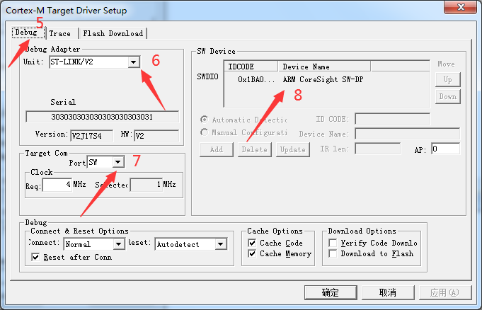
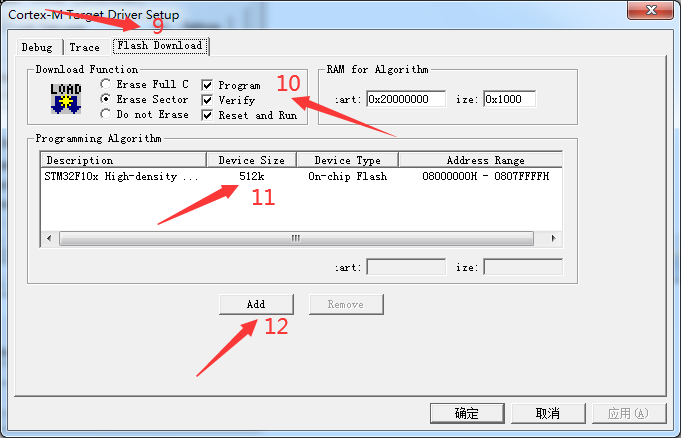

# 下载器

## 接线方法

下载接口留有4pin排针，至少连接3pin，分别是GND DIO CLK,3v3可以不接，如图所示：

## 软件配置

下载器线接好后（驱动安装参考1.2节），给开发板插入电源并开机，下载器接入电脑，打开一个KEIL例程文件，进行如下配置：

注意：第3步是选择我们的下载器，我们选择ST-link Debugger。

第4步后进入到如下界面：

注意：如果第8步和图中不一致，则有可能是如下原因导致：

* 下载器驱动没有安装成功；
* 下载器连接线有问题或者线序不对；
* 下载器没有接入电脑；
* 开发板没有接入电源并开机；

解决好第8步问题后进入如下界面：

注意：如果第11步没有内容，则应该点击12步去添加，选择第11步中的内容。

一路点击确定，配置完成；