# 1.5 协议接入  
##1.5.1 MQTT  
* 产品与设备的创建  
创建产品：[https://open.iot.10086.cn/doc/multiprotocol/book/get-start/product&device/product-create.html](https://open.iot.10086.cn/doc/multiprotocol/book/get-start/product&device/product-create.html "创建产品")  
创建设备：[https://open.iot.10086.cn/doc/multiprotocol/book/get-start/product&device/device-create/single-device.html](https://open.iot.10086.cn/doc/multiprotocol/book/get-start/product&device/device-create/single-device.html "创建设备")  
* 协议初识  
[https://open.iot.10086.cn/doc/multiprotocol/book/develop/mqtt/device/introduce.html](https://open.iot.10086.cn/doc/multiprotocol/book/develop/mqtt/device/introduce.html "MQTT简介")  
* 需要下载的资料  
程序代码\麒麟座开发板\麒麟座V3.2\2.kyLin-V3.2-OneNET-裸机-基础例程\7.ESP8266-MQTT_TYPE3-LED  
程序代码\麒麟座开发板\麒麟座V3.2\2.kyLin-V3.2-OneNET-裸机-基础例程\21.MQTT-例程  

* 设备登陆  
1.打开工程stm32f103.uvprojx  

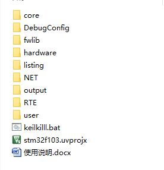  

2.打开工程目录下OneNET->onenet.c文件，修改第42行、44行、46行的设备登陆参数，分别对应产品ID、鉴权信息、设备ID  

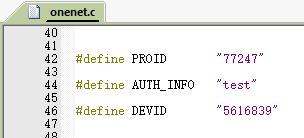  

3.打开工程目录下的net_device->esp8266.c文件，修改第36行的AP连接参数  

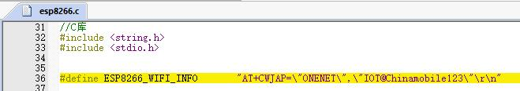  

4.配置MDK下载方式  

  

5.编译、下载代码到目标板  
6.给目标板上电，观察该设备在OneNET上的在线情况  

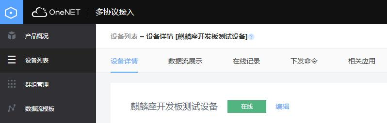  

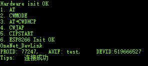  

* 数据上传  
当设备登陆成功之后，会以5秒的时间间隔自动上传当前4个LED的亮灭状态，0代表关，1代表开  

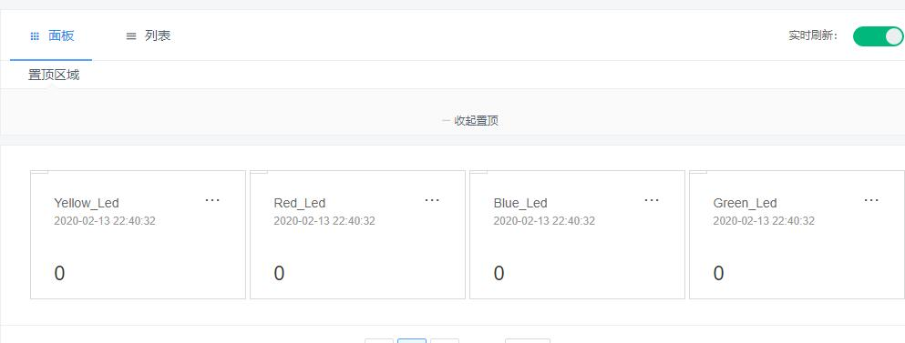  

* 命令下发  
在OneNET网页端或者使用API接口方式，填写命令 redled:1 即可  

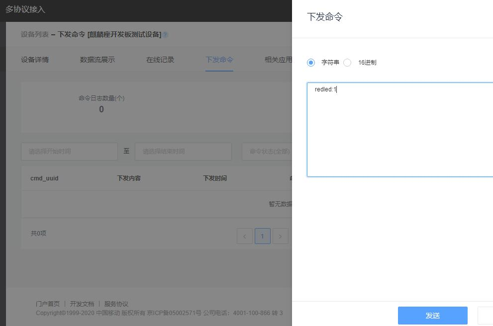  

设备在收到命令后会通过串口打印出来并执行命令动作  

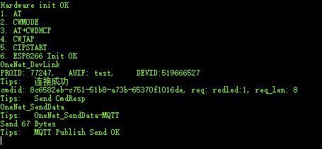  

在OneNET页面上也能够看到设备对命令的响应  

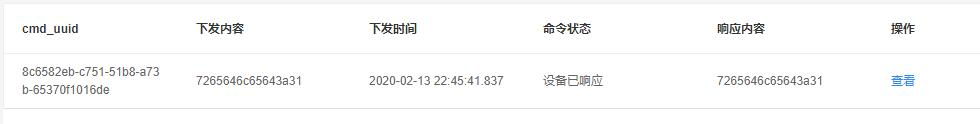  

在设备数据流里也能够看到数据点的变化  

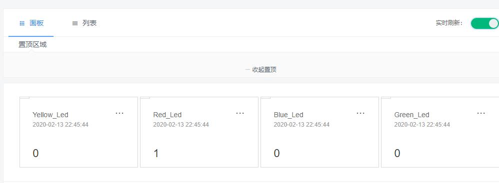  

* 心跳维持  
直接向平台发送心跳数据 0xC0 0x00 两个字节即可  
平台收到心跳维持后会想设备回复心跳响应 0xD0 0x00 两个字节  

* 发布与订阅  
打开 21.MQTT-例程 文件，里边有一个例程、一个MQTT模拟软件和使用说明  

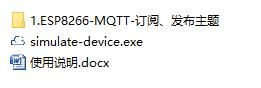  

先打开MQTT模拟软件simulate-device.exe，然后配置登陆信息，勾选Auto keepalive，点击Connect即可  

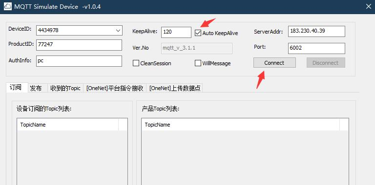  

然后打开例程，按照 设备登陆 小节修改相关信息；然后打开main.c文件85行、102行和111行，例程在设备登陆成功之后，先订阅一个toppic：“kylinBoard”
，然后以5秒的间隔时间向topic为“pcTopic”发布消息“MQTT Publish Test”  

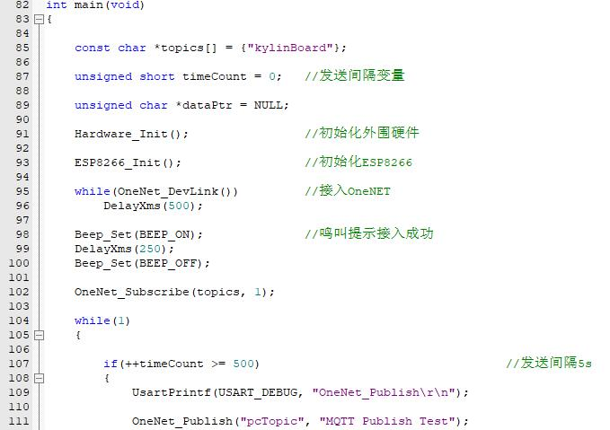  

然后在模拟软件中订阅一个topic：“pcTopic”，就能在模拟软件中的“收到的topic”选项里看到设备定时发来的消息，也可以发布里发布topci为“kylinBoard”的任意消息，设备也会通过串口将收到的信息打印出来  

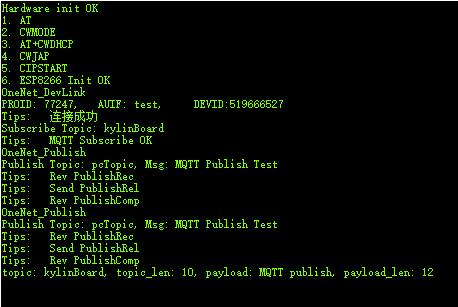  

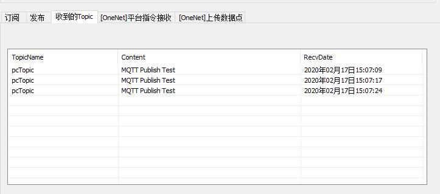  

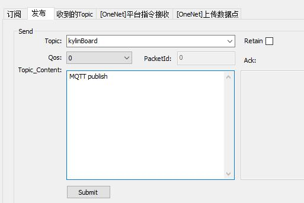  

* 例程移植  
以FreeRTOS例程为例  

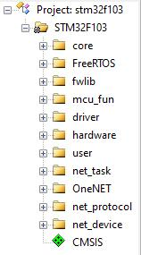  

core：硬件平台相关启动代码，不同平台需替换  
FreeRTOS：RTOS相关代码，需移植到对应硬件平台使用  
fwlib：硬件平台相关底层驱动，不同平台需替换  
mcu_fun：硬件平台驱动中间件，其他平台下可自行实现或不用该中间件  
driver：属于硬件平台驱动，不同平台需要自行实现  
hardware：外设硬件驱动，根据实际硬件编写相应驱动程序  
user：主逻辑代码，主要实现用户应用  
net_task：网络相关任务，不需要修改，但可以调整数据上传间隔、心跳维持时间间隔  
OneNET：与OneNET数据交互应用层，无需修改  
net_protocol：协议层，只需修改H文件里边内存分配规则即可  
net_device：网络模组驱动层，需根据实际硬件来编写对应的驱动代码  