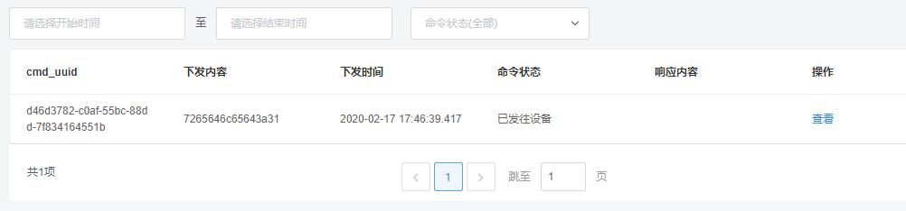

##1.5.5 TCP透传  
* 产品与设备的创建  
创建产品：[https://open.iot.10086.cn/doc/multiprotocol/book/get-start/product&device/product-create.html](https://open.iot.10086.cn/doc/multiprotocol/book/get-start/product&device/product-create.html "创建产品")  
创建设备：[https://open.iot.10086.cn/doc/multiprotocol/book/get-start/product&device/device-create/single-device.html](https://open.iot.10086.cn/doc/multiprotocol/book/get-start/product&device/device-create/single-device.html "创建设备")  
* 协议初识  
[https://open.iot.10086.cn/doc/multiprotocol/book/develop/tcp/device/introduce.html](https://open.iot.10086.cn/doc/multiprotocol/book/develop/tcp/device/introduce.html "TCP透传简介")  
* 需要下载的资料  
程序代码\麒麟座开发板\麒麟座V3.2\2.kyLin-V3.2-OneNET-裸机-基础例程\13.ESP8266-TCP-LED  
* 设备登陆  
1.打开工程stm32f103.uvprojx  

  

2.打开工程目录下OneNET->onenet.c文件，修改第42行、44行和46行的设备登陆参数，分别对应产品ID、鉴权信息、需关联的LUA脚本在OneNET上的名字  

  

3.打开工程目录下的net_device->esp8266.c文件，修改第36行的AP连接参数  

  

4.配置MDK下载方式  

  

5.编译、下载代码到目标板  
6.上传脚本 

  

7.给目标板上电，观察该设备在OneNET上的在线情况  

  

  

* 数据上传  
当设备登陆成功之后，会以5秒的时间间隔自动上传当前4个LED的亮灭状态，0代表关，1代表开  

  

* 命令下发  
在OneNET网页端或者使用API接口方式，填写命令 redled:1 即可  

  

在OneNET页面上也能够看到平台是否发送给设备  

  

在设备数据流里也能够看到数据点的变化  

  

* 例程移植  
以FreeRTOS例程为例  

  

core：硬件平台相关启动代码，不同平台需替换  
FreeRTOS：RTOS相关代码，需移植到对应硬件平台使用  
fwlib：硬件平台相关底层驱动，不同平台需替换  
mcu_fun：硬件平台驱动中间件，其他平台下可自行实现或不用该中间件  
driver：属于硬件平台驱动，不同平台需要自行实现  
hardware：外设硬件驱动，根据实际硬件编写相应驱动程序  
user：主逻辑代码，主要实现用户应用  
net_task：网络相关任务，不需要修改，但可以调整数据上传间隔、心跳维持时间间隔  
OneNET：与OneNET数据交互应用层，无需修改  
net_protocol：协议层，只需修改H文件里边内存分配规则即可  
net_device：网络模组驱动层，需根据实际硬件来编写对应的驱动代码  