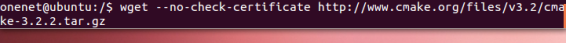

# 编译环境

编译环境选取的是基于VM软件的linux虚拟机。请按照下面步骤，完成VM、linux虚拟机以及各种工具的安装。

 VM安装

a.找到虚拟机10.0.1安装文件，点击右键，选择以管理员身份运行。

b.点击下一步，继续安装

c.选择接受协议并点击下一步安装

d.点击典型按钮继续安装

e.自主选择安装目录并点击下一步

f.取消掉启动时检查产品更新并点击下一步

g.取消掉帮助改善VM并点击下一步

h.可根据需求选择菜单方式，并点击下一步

输入密钥完成安装。

Ubuntu安装
a.选择新建虚拟机并点击

b.选择典型并点击下一步

c.选择安装程序光盘映像文件

d.从相应目录中选择镜像

e.根据需要输入用户名和密码

f.给虚拟机填写相关名称和存储路径，并点击下一步

g.分配磁盘空间40G，选择分成多个文件并点击下一步

h.点击启动虚拟机，虚拟机会自动启动并安装linux系统

交叉编译工具安装

交叉编译工具是嵌入式环境下的gcc，是gcc在arm版本，主要完成程序的编辑工作。
a.mkdir  arm-linux-3.3
b.复制uclibc_gnueabi-4.4.0_ARMv5TE.tgz 到/usr/src/arm-linux-3.3 
cp uclibc_gnueabi-4.4.0_ARMv5TE.tgz /usr/src/arm-linux-3.3 

c.解压工具链到/usr/src/arm-linux-3.3 
cd /usr/src/arm-linux-3.3
sudo tar xvfz uclibc_gnueabi-4.4.0_ARMv5TE.tgz 

d.设置默认工具链
切换root  su root
cd /root
Vim .bashrc
在.bashrh文件中的最后一行添加如下信息：
export PATH=$PATH:/usr/src/arm-linux-3.3/toolchain_gnueabi-4.4.0_ARMv5TE/usr/bin

退出保存
执行source .bashrc命令更新环境变量
在命令行输入arm，然后按TAB键，如果从，显示如下信息

e.兼容性问题
由于虚拟机为64位，安装工具链后依然提示找不到编译器，请按照以下命令进行执行即可解决。
Sudo apt-get install lsb-core
Sudo apt-get install ia32-libs

 Cmake安装

Cmake是一个建立与makefile体系之上的工具，其让开发者用更简洁和易读的方式撰写cmake文件并生成makefile。
a.sudo apt-get install build-essential 
b.wget http://www.cmake.org/files/v3.4/cmake-3.4.1.tar.gz 
tar xf cmake-3.4.1.tar.gz 

c.cd cmake-3.4.1 
./configure 
make 
sudo apt-get install checkinstall 
sudo make install 

