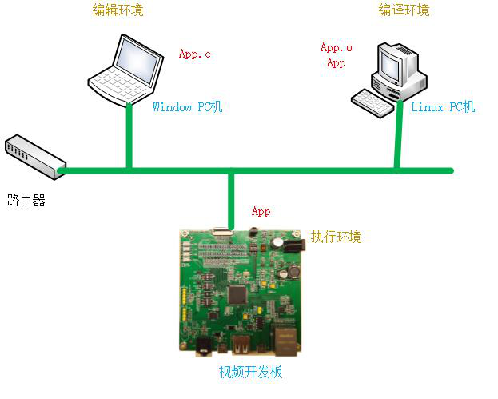

# 开发环境

视频开发板基于嵌入式linux系统，需要搭建开发环境。

嵌入式linux开发与PC环境下linux开发，区别主要由于PC与嵌入式硬件的硬件架构以及指令体系不一样导致不能和PC环境下直接编辑、编译、运行，

在嵌入式环境下这三个部分是分开的，编辑在windows PC机下完成(主要是利用各种编辑器)，编译在linux PC机（一般用虚拟机）下完成，执行则在

相应的硬件环境下进行。

开发者可自己搭建虚拟机开发环境，也可直接使用提供的linux虚拟机.虚拟机已安装好各种需要的依赖库以及工具，可直接应用于OneNET视频以及开发板视频程序开发。

若开发者自己搭建开发环境，请安装以下相关工具和库。

a. Openssl库

b. X264库

c. Rtmp库

d. Ssh服务

e. Nfs服务

f. Tftp服务

g. Linux/windows共享文件夹

h. 交叉编译工具 

i. Cmake编译工具

