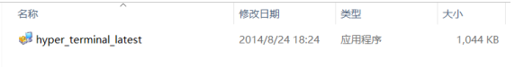
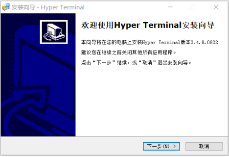
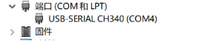
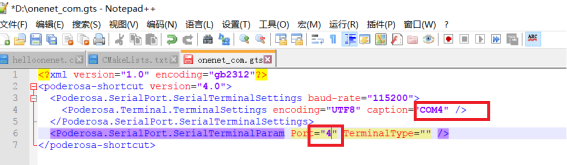
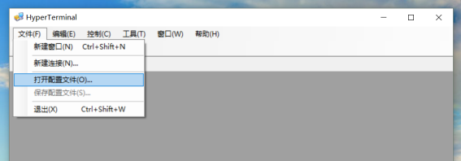
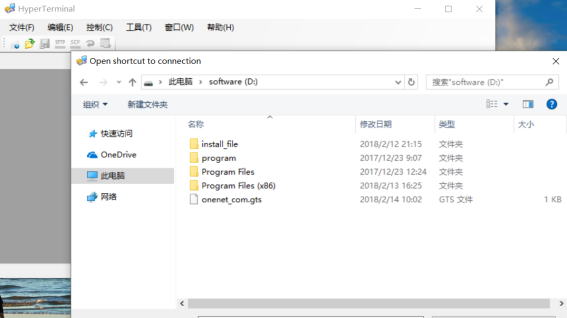
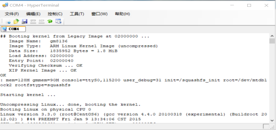
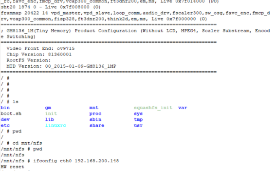

# 交互环境

由于开发板不带有LCD屏幕，主要通过串口，利用PC完成与开发板的交互。
用户可选择自己熟悉的串口终端软件。这里介绍超级终端。
a. 找到超级终端安装文件

b. 点击安装，安装过程并无特殊要求，按照流程安装即可。

配置终端
由于选择很多笔记本或台式机已经不带有串口，因此开发板配置了USB转串口的转换器，将装换器插入电脑USB接口，通过设备管理器查看端口号。

找到onenet_com.gts文件，打开onenet_com.gts文件，并其中的端口号改为设备管理中的端口号，比如上面的COM4。

打开超级终端，选择文件--打开配置文件

选择并打开刚才复制的onenet_com.gts文件

启动开发板，插上串口杜邦线。

可通过超级终端输入linux命令操作开发板，实现与开发板的交互。

