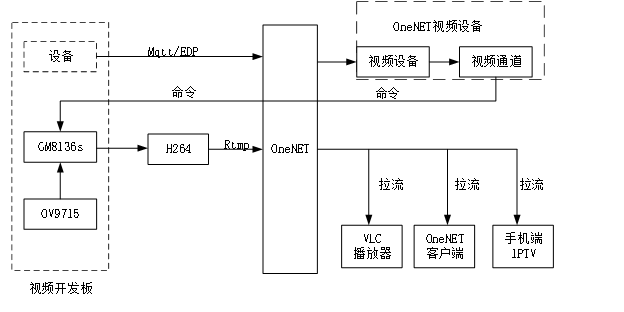
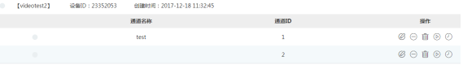
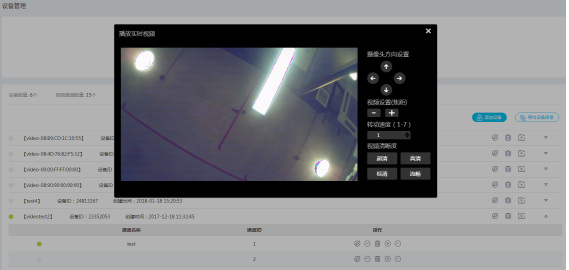
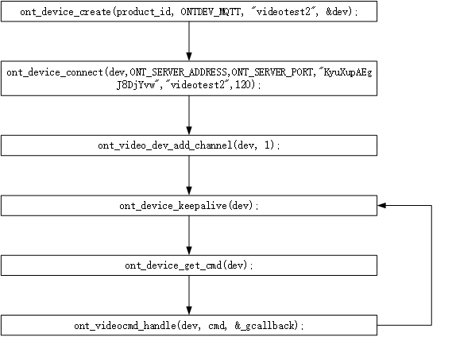
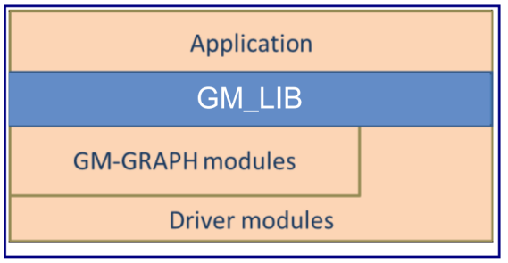
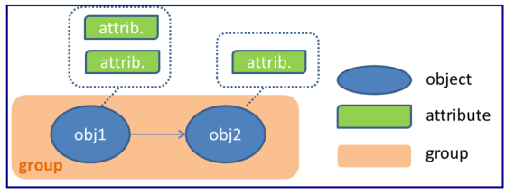
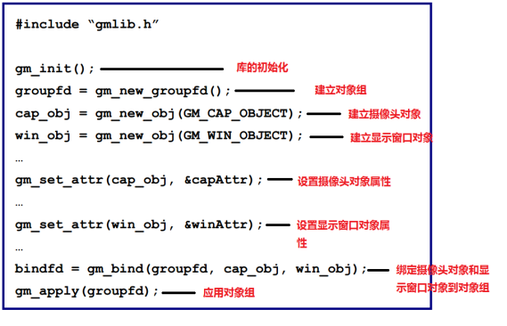
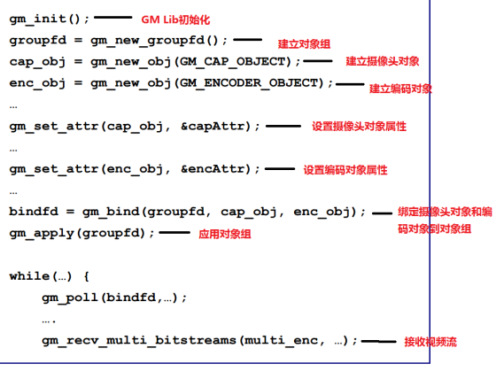
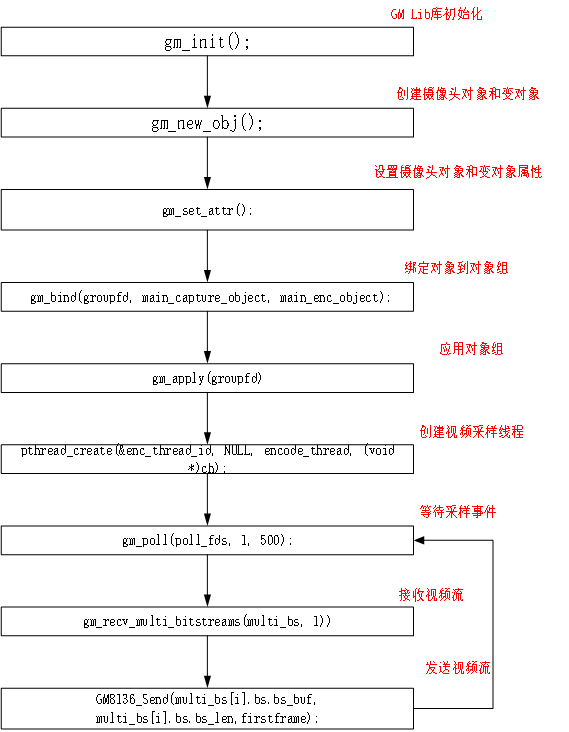
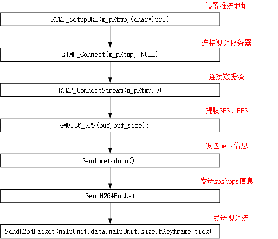

# 平台接入
a) 基础介绍
下图为开发板视频OneNET推送体验架构图，主要包含OneNET视频设备管理、GM8136s的视频采样与rtmp推流、各种客户端的数据拉流播放三个部分。

OneNET视频设备管理：
该部分主要是通过创建OneNET视频设备，为开发板与平台的建立交互通道，完成开发板数据上传和OnNET命令下发。视频设备创建包括设备创建和通道创建，创建完成后在OneNET开发者中心可见到如下界面。通过界面可以完成视频播放、历史查询以及包括设备建立、删除等各种设备基本操作。

GM8136s的视频采样与rtmp推流
GM8136s是开发板的核心，完成了视频的采样编码以及视频流推送。视频的数据采样编码主要依赖于GM8136s提供的开发库，其可直接输出包括H264、MPEG等各种格式的视频数据，视频推送可以直接使用sdk提供rtmp接口和自主设计的rtmp接口。
各种客户端的数据拉流播放
拉流播放可通过各种途径实现，主要通过第三方工具。比如VLC media player、手机端IPTV播放器以及OneNET的开发者中心提供的播放功能。

b) 程序设计
     程序主要包含视频设备管理、视频采样、视频推流三大部分组成。
视频设备管理
视频设备管理的接口函数可以查看
https://open.iot.10086.cn/doc/art386.html#68，主要查看视频能力中的管理控制台和接入SDK，二者可通过对比手动和自动创建设备流程，查看各个接口函数的功能。下图为视频设备的创建流程以及主程序架构。

视频采样
视频采样主要依赖于GM8136s平台提供的GM_LIB开发库实现。GM_LIB为应用程序访问GM8136s芯片的各种功能提供接口。通过使用该库，可以实现很多功能，包括直播、录像、回放等。软件层面，GM8136s平台可分为四个层次，包括应用层、GM_LIB库层、GM图像模块、linux驱动模块。

应用层：应用层主要是用户的应用程序。用户应用程序可通过GM_LIB完成各种功能。
GM_LIB层：负责应用层与图像层以及驱动层的交互
GM_GRAPH层：主要完成图像任务调度以及一些硬件初始化工作
Driver modules层：linux驱动层，完成与硬件的交互。
GM_LIB将每一个输入输出作为一个对象，比如视频采集是一个对象、视频显示也是一个对象、文件的输入流和输出流也分别是对象。用户应用程序可对每一个对象进行属性设置，并将需要的对象的进行绑定(group)从而实现一个应用程序功能。

GM8136的编程一般按照如下流程：
开始流程
建立对象object
设置对象属性
建立对象组
绑定对象到对象组
应用对象组
发送或接收数据流，完成需要的功能
结束流程
停止数据流的发送和接收
解绑对象
应用到对象组
删除对象和对象组
比如本地直播

比如录像应用

更详细内容可参考GMLIB_Programming_Guide_V1.10文档。
视频采集的程序流程和上述举例的流程并无大的不同，流程如下图：

视频推送
视频推送主要通过rtmpdump库完成，大致流程如下：

