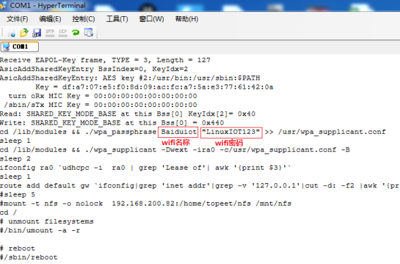
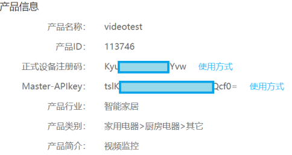
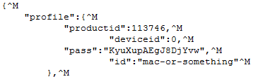
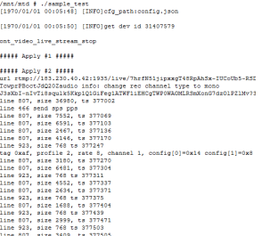
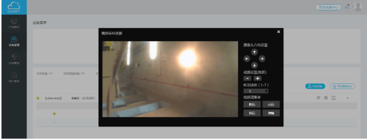

# 功能体验
a) 基础介绍
功能演示需通过与开发板交互完成，若无嵌入式linux使用或开发经验，请先阅读附录1，并按照附录1.3.2完成超级终端的安装。
b) 开发板交互
可在超级终端输入相关命令进行开发板操作，例如设置系统时间
输入命令:date 2018.08.22-10:14:00,即可将系统设置为所需要时间。
c) 设置网络
开发板配置wifi和有线两种网络通信方式，开发者可自由选择任意一种。
有线网络
设置IP地址命令：ifconfig eth0 192.168.200.172
设置网络命令：route add default gw 192.168.200.1  
WIFI
进入/usr/onenet目录,并打开wifi.sh，将其中的wifi名称和wifi密码改成需设定的wifi名称和wifi密码，并保存。

执行wifi.sh脚本，连接wifi。sh wifi.sh
注：所有体验实验都需要网络，请务必先设置网络。
d) 视频直播体验
目的：让用户快速体验视频能力。
OneNET 视频体验实验功能:
以官方SDK为基础，实现视频直播功能。
体验流程：
请按照https://open.iot.10086.cn/doc/art388.html#68中介绍的步骤，在onenet中创建视频产品和设备，并获取产品ID和注册码。产品管理页获取产品ID，注册码

进入开发板目录 /usr/onenet
使用vi config.json命令修改config.json文件

将productid、pass的值修改为上面所创建视频设备的产品ID，注册码，deviceid可设置为0，id可自主设置。
运行./sample_test

通过onenet视频管理页面即可观看视频

