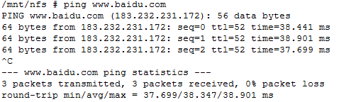
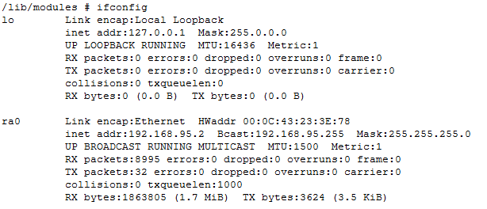

# OneNET视频开发板接口测试
a) 开发板上电
接上5V电源适配器，按下开关，开发板上电。正常状态下：LED1灯亮。

b) Usart/开发板启动
打开超级终端。插上与串口连接的出口线(若笔记本电脑无串口，可使用串口-USB转换器)，开发板启动，超级终端输出界面。

可通过超级终端输入相关命令进行交互比如ls

c) 按键
输入命令./saradc_test 执行saradc_test程序，可测试按键。

d)以太网
通过ifconfig设置IP地址，并通过ping命令测试网络

e) Wifi
接入wifi热点，其中Baiduiot为热点名称，LinuxIOT123为wifi密码，需替换为自己的wifi信息。

/wpa_passphrase Baiduiot "LinuxIOT123" >> /usr/wpa_supplicant.conf

./wpa_supplicant -Dwext -ira0 -c/usr/wpa_supplicant.conf -B

获取IP
ifconfig ra0 `udhcpc -i  ra0 | grep 'Lease of'| awk '{print $3}'`
route add default gw `ifconfig|grep 'inet addr'|grep -v '127.0.0.1'|cut -d: -f2 |awk '{print $1}'|awk '{split($0,ip,"." ); printf "%s.%s.%s.1\n",ip[1],ip[2],ip[3] }'`

测试

f)
通过命令mount -t vfat /dev/mmcblk0p1 /usr/tfcard挂载tf卡

g)
通过执行audio_livesound测试音频的输入和输出

h)
进入/mnt/mtd ,执行rtspd程序，可在PC端通过VLC等播放器播放实时视频。

