# OneNET视频开发板接口

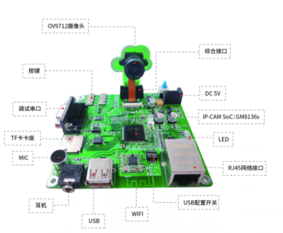

a) 电源接口
输入电源为5V，接口如下图所示，请使用官方配置适配器接入电源。

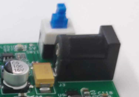
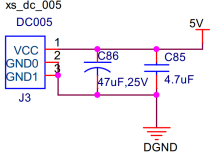

b) 以太网接口
开发板提供100M以太网，请根据需求配置IP地址使用

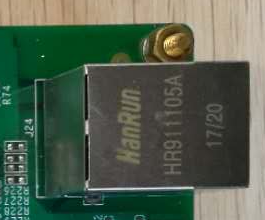
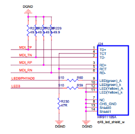

c) 串口
串口主要用于用户开发者与开发板交互，搭配官方所配的USB转串口线使用

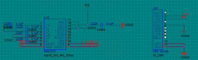
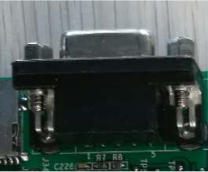

d) USB/WIFI
USB可外插USB 设备

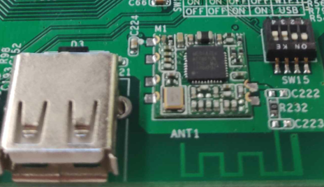

USB接口与WIFI共用一个USB通道，因此二者不可同时使用，需通过SW15拨码开关进行配置，当拨码开关1、2处于连通状态(开关靠近ON)，可用USB接口；当拨码开关3、4处于连通状态(开关靠近ON)，可用WIFI；

e) 按键
配置8个按键，通过AD采样实现按键区分。

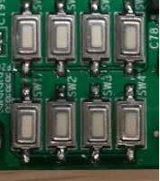
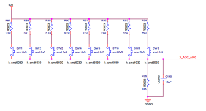

f) 摄像头接口
请配合官方配置摄像头使用

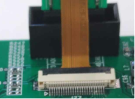
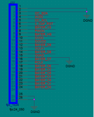
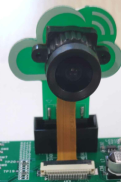

g) MIC接口
配置咪头MIC，供开发者进行语音应用开发。

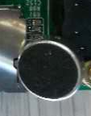
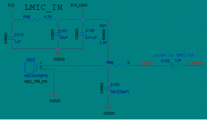

h) 耳机接口
配置耳机接口，供开发者进行语音应用开发。

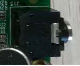
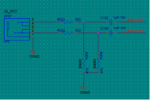

i) TF卡
开发板可使用TF卡作为外部存储

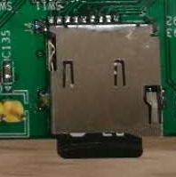
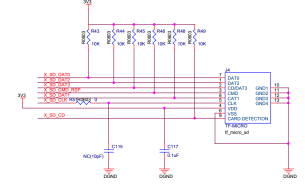

j) LED
配置4路LED

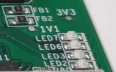
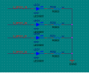

k) 综合接口
扩展接口提供一路USART、一路PWM、一路I2C、一路红外、两路ADC供开发者使用。

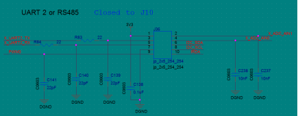
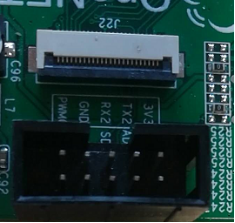

l) 配置开关
配置开关与系统启动相关，请保持SW14 1,2处于断开状态，否则系统无法启动。

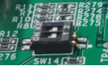

