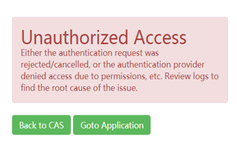

# 应用开发环境

#### 1.应用开发环境如何修改应用名称？

namespace命名空间一旦提交不能再更改。

#### 2.无法进入/登录应用开发环境，页面显示Unauthorized Access？    
 
 
原因在于账号名称太短或者出现了特殊字符，一般建议为名称多于8个字符。解决办法有两个：第一，如果可以再重新注册另一个账号，粗避开这个坑；第二，修改账号名称，隔天就可以进入了。

#### 3.应用开发环境用的是什么语言？

typescript。

#### 4.应用开发环境如何修改应用名称？

namespace命名空间一旦提交不能再更改。