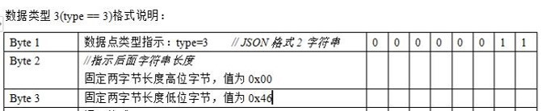
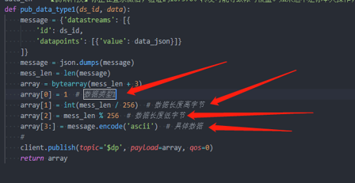
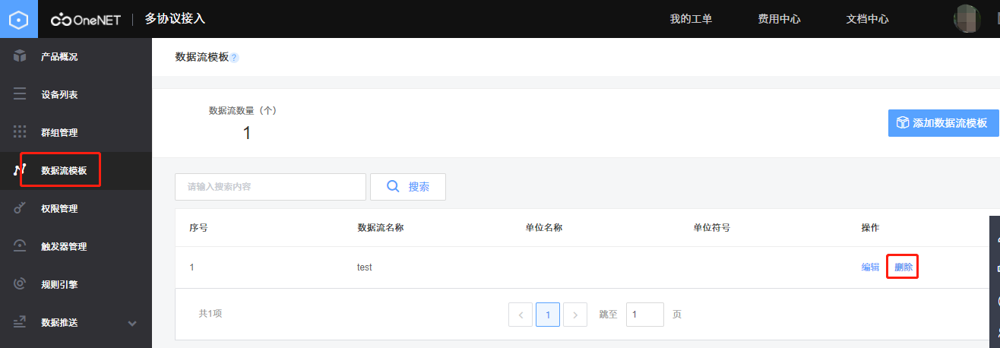
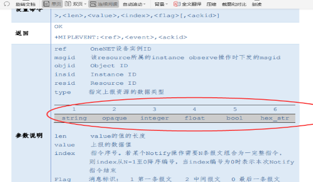
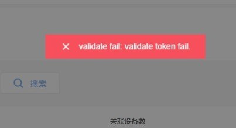
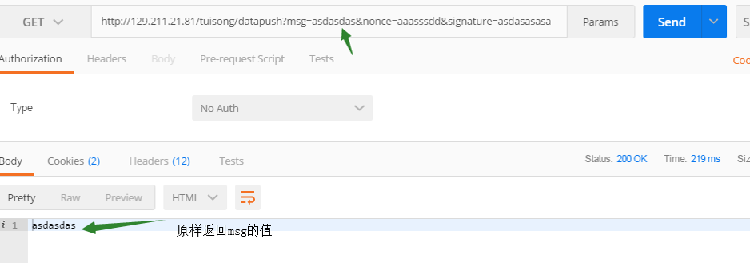
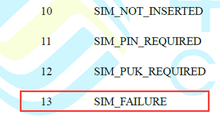

# 平台通用

## [产品/设备的增删改查]

#### 1.OneNET协议适配服务在哪里开通啊？

控制台-左上方-全部产品服务-协议适配。

#### 2.OneNET平台支持modbus TCP吗？

不支持modbus tcp，支持modbus和modbus rtu，modbus TCP也可以用tcp透传的方式，或者可以自行在tcp协议里自己写个解析脚本。

#### 3.OneNET平台支不支持私网通道？

不支持。

#### 4.利用js或者ajax可以接入OneNET吗？

两个都行，有个后端的nodejs的sdk，也有适用ajax的c#。

#### 5.创建产品是不是只能指定一种接入协议？

用户根据应用场景选择一种协议，一个设备只能按照一种协议与平台交互。

#### 6.产品创建完成之后，可以修改通信协议么？

不可以修改的，如果能修改了，那么产品下面的设备鉴权信息和方式会发生变化，会造成混乱。

#### 7.一个产品下面可以创建多少设备？

一个产品下可以创建多个设备，根据实名认证的不同类型，有不同的限制。普通用户产品3个，设备100个；完成个人认证用户产品10个，设备1000个；完成企业认证用户产品、设备暂无限制。

#### 8.产品APIKEY和设备APIKEY有什么区别？

产品key可以针对该产品下所有设备进行操作，设备key只针对关联的设备。

#### 9.设备注册和设备添加有什么区别？

设备添加通过产品的Api-key进行新增，设备注册通过产品的正式环境注册码Register-code进行新增。两者取得的效果都是新增设备。

#### 10.OneNET开发文档中注册与新增的区别是什么？

新增设备是通过masterkey作为验证；而masterkey的权限很高。如果不想把masterkey给出去，就用注册的方式，只给注册码即可验证，注册码只能用于注册，权限较低。该功能针对于一个产品下有多个设备供应商的情况，给设备供应商注册码即可，不用给masterkey。

#### 11.OneNET平台采用设备自主创建的方式，一个设备可以多次重复注册吗？重复注册产生的设备ID是相同的还是随机的？

公开协议的产品，只要sn或者mac相同，要么得到的devid和apikey就是相同的，也就是可以重复注册。

#### 12.OneNET可以批量添加/删除设备吗？

目前仅有Studio提供有批量添加设备的api。其他如NB-IoT物联网套件、MQTT物联网套件以及多协议接入均没有提供批量添加/删除设备的API，均需要循环调用添加设备/删除设备api来实现批量，或者直接页面批量导入。

#### 13.怎么批量添加设备呢？这个是有后台来做还是开发设备的人来添加？

NB的设备可以批量模组导入imei。EDP或者MQTT可以设备侧调用注册设备的API来完成。

#### 14.OneNET的设备ID和APIkey支持批量吗，多块终端的时候怎么办?

支持批量，有两种办法。在页面批量创建设备；硬件设备调用api自动创建设备。

#### 15.如果批量生产时，每一个不同的key值是如何解决的？平台生成新的key值在硬件端要做什么处理？

key设备端可以不要，你用鉴权信息作为psw登录就可以了。

#### 16.设备接入对操作系统有要求么？Android、Linux、rtos都可以么？

都可以，按照接入套件规范发送正确报文即可。

#### 17.Esp8266怎么接入OneNET？

纯8266就用sdk改，单片机加8266就根据平台协议接入，AT也可以。

#### 18.树莓派怎么接入OneNET？

用c语言libcurl或者用python。先选定构架，mcu型号，在根据设备使用性质决定用什么协议，长连接用MQTT，EDP传感器低功率用LwM2M。

#### 19.LoRa节点或网关有办法接入OneNET吗？

原则上只要能连广域网，都可以连OneNET平台，比如网关可以通过MQTT协议连OneNET。OneNET和局域网通信方式无关，你用LoRa、蓝牙都没关系，但是你的LoRa节点要能通过TCP ip连广域网，或者你的LoRa节点组局域网和你的网关通信，网关在和OneNET通信。

#### 20.AUTH_INFO填什么？

鉴权信息，创建设备时自定义的。现在一般不填，模组还没有适配这个字段。

#### 21.client id填什么？

client id，设备ID是设备名称，不是设备ID。

#### 22.设备ID可以用户自己设置么？还是OneNET自动生成？

设备ID都是由平台自动生成的。

#### 23.API里有根据MasterKey获取产品ID的方法吗？

产品ID目前没有相关API可以使用，其他API详见开发文档应用开发。

#### 24.设备管理中的正式环境注册码是怎么用的?

在调用注册设备的api会使用到注册码进行设备注册。

#### 25.平台上的新增APIKEY功能有什么用？

是一个权限分发。如果你只想某个客户访问特定设备的数据或者进行控制的时候，就给他设备级别的apikey防止对你其他设备进行越权控制。

#### 26.设备在线要用哪个协议？

MQTT、EDP、LwM2M、TCP。

#### 27.OneNET设备在线离线是什么一个机制？

设备在发送注册包登录后，就会在线。设备超时时间内未发送心跳或者上传数据就会离线，发送信息格式等错误时也会强制离线。

#### 28.设备正常连接平台后，平台什么时候会断开设备连接？

情况一：发送非法数据会断；    
情况二：心跳保活时间内未上传心跳包会断；    
情况三：设备主动发送断开连接的指令。

#### 29.OneNET设备在线后没发数据多久会掉线？

平台显示在线只跟你设置的生命周期有关，就是open后面的那个参数。除非你主动注销登录或者生命周期到了，才会显示离线。没有设置就是默认86400秒，一天。

#### 30.OneNET怎么实现判断设备是否在线吗？

产品页面设备名称前指示灯显示绿色为设备在线，当显示灰色时为设备离线。

#### 31.平台显示设备在线，但是设备列表里的对象数量是0，正常吗？

没有发现资源，重新走一下订阅和发现俩步骤。

#### 32.为什么我的设备在线一秒就掉线了？

可能是数据封装格式不对。你可以试试只登陆，然后不发任何东西，秒踢多半是登录成功之后发了错误的数据导致的。任何不符合格式的数据都是错误数据。

#### 33.在设备列表里，显示设备状态为离线，激活状态为未激活。怎么理解未激活呢？

创建了实际从未登录过就是未激活，实际设备连接一次之后就激活了。

#### 34.设备在线且订阅成功，但打开资源列表什么也没有，是什么原因？

请排查以下4个方面：创建设备的时候订阅打开；设备列表自动发现资源打开；设备回复平台下发的订阅发现不成功；设备模组侧添加资源对象不成功。

#### 35.设备端资源受限，不能用SSL加密，有没有哪个通道是非加密的？现在用183.230.40.16:8883不用TLS根本连接不上。

非加密端口没有全面开放。

#### 36.AT+MIPLOPEN= , 官方文档中lifetime是指注册到 OneNET 平台的生存时间，但是具体这个值有什么作用呢？这个值到期后会引发什么操作呢？还有这个值的大小最好设置多少呢？文档中的例子是：AT+MIPLOPEN=0,3600,30 ？

lifetime是页面显示在线的时间，在线就可以notify，离线了要登录后才能notify。

#### 37.请问什么是保活时间？

不用发心跳也不会断开连接的一个时间。

#### 38.移动平台设备保活时间lifetime是多久？这个决定哪些参数？

平台最大支持2的31次方减1秒。这个参数一般可以通过AT+MIPLOPEN或者AT+MIPLUPDATE改变他的值。

#### 39.超过注册的存活时间会怎么样？

设备会从OneNET平台离线。

#### 40.如果设备断网，OneNET多久才发现设备掉线？

会等到保活时间lifetime到期后，OneNET才发现设备掉线。

#### 41.设备关闭后，平台上多久后显示离线？为什么有时候要20分钟才显示设备离线。

在设备登录的时候有一个keepalive字段，就是保活时间，在设备无任何数据交互的时候开始，在这个时间之后平台会认为设备断线。

#### 42.如果想要设备保持长连接，notify应该多久同步一次？

网络侧最多保活2分钟。为了稳当，你要一分钟上报一次数据。或者去找运营商，开通GRE专用APN。通用APN会存在2分钟左右端口老化的问题，所以达不到实时控制。故引入了GRE专用APN，以延迟端口老化的时间。

#### 43.如何开通GRE专用APN？

第一步，通过各省公司客户经理申请开卡，OneNET专用APN为CMNBIOTOneNET；    
第二步，完成开卡后终端侧连接模式为接入机模式（模组-b参数为0），地址为192.168.24.100：5683，门户地址为重庆主平台：[https://open.iot.10086.cn](https://open.iot.10086.cn) ；    
第三步，关闭PSM，eDRX即可。

#### 44.OneNET离线设备如何重新登录？

设备离线后，重新登录和初次登录步骤相同。如果为保证设备不出现掉线，及时发送心跳包。LwM2M协议的设备及时发送AT+MIPLUPDAT指令。

#### 45.在线的设备不能删除吗？

是的，等它离线再删除。

#### 46.OneNET平台如何批量删除设备？

不支持批量删除设备。

#### 47.OneNET平台的产品或设备不小心删除了，还能恢复吗？

平台产品或设备删除后，不能恢复。

——————————————————————

## [数据格式与配置]

#### 48.一个设备下面可以添加多少数据流？

一个设备下可以创建多个数据流，目前平台不限制数量。

#### 49.请问一个数据流可以传送两种及两种以上的不同数据么？

不可以，建议创建两个不同的数据流。

#### 50.为什么上传到OneNET的数据一会儿是图一会儿是点？

上传到平台的数据都是以数据点的形式上传，平台不支持图片展示功能。

#### 51.数据流单位和符号是随便填的么？跟设备里面DATA_TYPE上传数据类型有关么？

可以随便填。

#### 52.地图的数据流只能选择一个，这个数据流的数据该是什么样的，定位需要x，y两个点的数据？

一个数据流里面包含经纬度两个信息，value是数据流名称后面的是值。

#### 53.OneNET能不能自定义数据包格式？

可以，但得自己写解析函数。

#### 54.这个数据类型格式前三位具体传什么？
  
如下图所示：    
  

#### 55.OneNET的数据能保存多长时间？容量是多大？

OneNET平台数据保存时间为一年，容量不限。

#### 56.OneNET最大一帧支持多少数据？

二进制文件上传最大800K。
 
#### 57.OneNET支持对数据存储加密吗？

只要存储的都有加密。

#### 58.创建对象时，每个对象设置的属性、实例的个数有要求吗？需要怎么设置？

没有要求，用模组AT指令设置。例如AT+MIPLADDOBJ=0,3200,1,"1",0,1；AT+MIPLDISCOVERRSP=0,3200,1,4,"5750"。

#### 59.一个对象下如何创建多个实例呢？

在addobject的时候，设置对应的参数就行。

#### 60.平台的数据可以导出、删除、修改和分析处理么？如何实现？

目前平台提供API供用户进行数据/设备管理，详情请见：[开发文档](https://open.iot.10086.cn/doc/v5/develop/)>选择接入协议>开发指南>API。

#### 61.平台的数据流可以删除么？如何删除？

数据流现在可以删除，[控制台](https://open.iot.10086.cn/console/)>在顶部全部产品服务中选择接入协议>选择产品>数据流模板>操作>删除按钮。    
 

#### 62.OneNET里如何删除数据点？

数据点已经上传了，就在OneNET的数据库里面，是不能随意删除的。

——————————————————————

## [南向数据上报与命令下发]

#### 63.设备上报数据到平台的地址是什么?

每个协议接入的IP加端口不一样，详情参考：开发文档-选择协议-设备开发指南-开发指南。

#### 64.我需要一个上传数据和云端控制的功能，应该选择什么协议？

MQTT、EDP。

#### 65.订阅有什么用？

平台subscribe订阅之后，模组publish消息的时候平台就能收到publish的消息。

#### 66.经常遇到设备在线，而订阅失败，这个是什么原因？

这个是因为没有发现资源，有可能设备侧没订阅资源，也可能因为网络原因没订阅成功。需要排查下设备侧，最好把设备侧log打出来，看为什么没发送成功。

#### 67.获取历史数据的时候，返回的数据点是1分钟一个。如何修改数据点的密度，比如10分钟一个数据点？

设置url参数，关于时间的，默认是返回最新的一个。

#### 68.在野外数据无法上传OneNET如何处理？

信号不好的时候，设备自己要有补发机制，本地先保存数据，网络恢复时补发之前网络异常时的数据。

#### 69.设备发送心跳包上去，OneNET不响应心跳应答？是什么原因？

ping，是不应答的。你可以上报数据代替心跳。就有应答了。

#### 70.用WIFI透传把定位数据送到云平台，一定要用HTTP是吗？用lua解析可以吗？

可以。

#### 71.日志显示一直有设备在连接，但是报鉴权失败，并且触发了我们这边设置的鉴权失败次数的阀值。请问怎么能确定是哪些设备鉴权失败呢？

设备id，登录鉴权肯定有设备id的。

#### 72.OneNET api如何能获取设备的上下线历史记录？

暂时没有这个api接口。

#### 73.超过了OneNET的lifetime生存周期，被平台踢下线后，若要上报数据，是要重新发起注册还是怎么操作？

重新发起。一般在生命周期过期之前去updata更新下。

#### 74.自动发现资源开启和关闭有什么不同？

关闭自动发现资源，就没有discover这步。

#### 75.如果observe和discover没有及时回复，是不是只能close掉reg之后重新open？

你需要看资源列表就要重来一次，不看只资源列表的话，可以进行数据上报，命令下发。区别仅仅是有没有资源列表，不影响其他功能。

#### 76.写设备资源和命令下发，有什么区别吗？

写和执行均可对设备进行命令操作，执行只支持字符串下发，写的类型支持更多。

#### 77.OneNET平台下发命令的“读、写、执行”三种方式，区别是什么？分别于什么情况下使用？以及各命令的使用场景？

读：OneNET发起读取之后，NBIOT设备会受到读取的命令，然后NBIOT设备回复读取命令，回复读取的命令会包含要读取的信息。    
写：向NBIOT设备执行写操作，NBIOT设备会获取到相关写命令，然后取执行对应的操作。    
执行：和写差不多，执行只能发string格式。

#### 78.即时命令和缓存命令有什么区别？

下发即时命令需要设备在线且下行端口没有老化的时候才能抵达设备，缓存命令可以在设备离线的时候下发，等待有上行数据的时候抵达设备。    
即时命令：三方平台下发命令到OneNET，OneNET立即将命令下发给设备。    
缓存命令：三方平台下发命令到OneNET，设置好触发下行的条件，OneNET先把命令保存起来，等满足了条件再下发给设备。两种命令设备都需要回复到平台，平台拿到结果会立即转发给三方平台。

#### 79.OneNET怎么下发数据给设备？

平台向设备发送数据使用不同协议有不同的发送方式，详细方式见使用协议接入文档。

#### 80.OneNET有没有收到模组消息后自动应答确认的机制？发送了notify或xxxxrsp后，怎么确认OneNET收到了，然后判断是否要重发？

上报数据的AT指令NOTIFY有可选参数ackid，带这个参数上报，平台会回复。

#### 81.哪些协议支持离线命令？

EDP、MQTT、NB-IoT。

#### 82.如何通过OneNET平台发图片给单片机？

直接发十六进制。

#### 83.单片机希望通过6312获取网络上的时间，OneNET可以获取网络时间吗？

直接去ntp服务器拉时间，开发板例程有，参考下。

#### 84.用ESP8226能解平台下发的数据，但是M6312就不行。这个两个的解包方式应该是一样的，为什么会这样呢？

可以看看6312上电时的串口打印，如果是v28版本的就需要更新固件。

#### 85.OneNET平台是不是会定时或者不定时对模组进行读操作？这个功能可以关闭吗？

读都是有上行比如登录的时候读取版本号，不会定时不定时去读的。

#### 86.是不是只有ipso的obj_id平台才会识别出来这个obj的读写属性，其余的，非ipso的都识别不出来，想要读、写，必须调用api？

是的。

#### 87.平台写操作一次能发多长字符串，客户测试最长为233字符，是否超过233就需要分包发送？

最常2K，然后会分包，每包512字节。

#### 88.离线命令的失败重试次数中的失败，指的是下发失败还是执行失败？

指的是下发了，但设备没正常响应。

#### 89.为什么发送命令会出现internal error？

可能调用太快，等一下再试。

#### 90.OneNET平台下发的命令该如何切割？

分块传输。API下发命令最大2kb，然后分块最大是512字节。

#### 91.想同时给多个设备设置相同的指令，只用调用一个接口，有没有批量发送命令的接口呢？

没有。

#### 92.OneNET上每个设备的缓存命令可以有多少条？

NB的设备目前最多缓存10条，其他设备没有限制。

#### 93.下发命令时没有提示参数错误，为什么读缓存命令执行情况时提示，执行状态是：请求参数错误?

这个错误一般是资源类型和参数中的类型不一致导致的，这个只能在执行中才会判断。

#### 94.我在服务端下发一下close命令，客户端收命令后关机，但重启后还是收到了CLOSE命令。这是什么问题? mqtt svrpublish $creq/c457c6f7-7c14-5314-9148-3294abe48687 nil close

和qos有关，0：最多发送一次，不关心设备是否响应 1：至少发送一次，如果设备收到命令后没有应答，则会在下一次设备登录时若命令在有效期内（有效期定义参见timeout参数）则会重发该命令。

#### 95.OneNET平台现在支持文件下发吗？

没有下发文件的接口，只有文件上传，命令下发。

#### 96.离线命令的超时时间如何设置？

设置timeout参数，命令有效时间，默认0。0：在线命令，若设备在线，下发给设备，若设备离线，直接丢弃。>0： 离线命令，若设备在线，下发给设备；若设备离线，在当前时间加timeout时间内为有效期，有效期内，若设备上线，则下发给设备。单位：秒。有效范围：0~2678400。

#### 97.如何查看在平台发送的命令是否成功？

如果在应用调用的API指令成功后，OneNET平台会返回执行结果。

#### 98.缓存命令是如何下发的，是下发1条等回复，有回复后发另1条？无回复发吗？

如果下发10条notify触发类型的缓存命令，登录上线第一次notify上报数据，进而收到第一条命令，模组RSP回复；马上收到第二条，模组RSP回复；马上收到第三条，模组RSP回复；收到第四条以此类推。

#### 99.如果下发的缓存指令超过10条，是不是刚开始的几条就自动失效了？

会提示你发不下去的，队列里面最多就10条。

#### 100.调用即时命令API，命令下发，一直提示超时，是什么缘故？

如果长时间没有上行数据，核心网会踢掉之前缓存的连接信息，路由是找不到设备的，所以会导致超时。此时就必须等待设备再次（如0.5h设备上传一次数据）给平台上传数据，即等待通信链路的恢复。参考：[https://blog.csdn.net/qq_43359106/article/details/84334494](https://blog.csdn.net/qq_43359106/article/details/84334494)。

#### 101.写缓存指令时，写的是非opaque类型，非opaque类型是整形、浮点、字符串、布尔哪种？

上报数据什么类型，就是什么类型。    
  
 
#### 102.为什么下发数据都是超时，设备也收不到下发的数据？

上报数据2分钟内下发，且需要设备响应。

#### 103.OneNET平台，命令下发调用接口有次数或时间限制吗？

单个设备间隔时间1s，没有次数限制。

#### 104.调用api缓存下发，如果有多个write消息，平台多长时间下发一次，是不是收到了上次的rsp就下发？

设备上报完数据就下发。

#### 105.平台下发指令这个接口，要做了设备接入开发之后才能调用成功吗，还是说显示了在线就能发送了？

显示在线就能发。

#### 106.OneNET平台除了可以获取实时数据外，还可以获取历史数据吗？

可以的，就是保存时间有限制，如果要长时间存的话建议存到自己的服务器里。

#### 107.请问平台上收到上传的数据后会隔多长时间再推送给订阅了主题的在线设备呢？

立即。

#### 108.OneNET平台有矫正对终端设备时间的功能吗？

有的，不过是设备主动校正。平台提供了这个服务，设备调用平台的服务就可以了，按照标准NTP协议就行。

——————————————————————

## [北向数据推送]

#### 109.OneNET上配置的推送数据链接跟鉴权链接是同一个链接么？

是的，设置填完后会验证，验证过了会推送。

#### 110.第三方应用接入OneNET大概是怎样的一个顺序？目前已经在开发这平台注册账号、添加了产品、注册了设备。

接下来你需要将在平台上注册的信息跟你现有的设备相对应：根据你注册的相关信息，参考开发文档不同协议对于的服务器端口地址、相关上传规则、产品ID等信息与设备绑定，然后在上传OneNET就可以在平台上看见你上传的信息了。

#### 111.可以自己写个windows客户端从OneNET上读取数据吗？

可以，OneNET有API接口。

#### 112.自己的服务器或者微信小程序怎么跟OneNET通信？

调用API，发起GET或者Request请求，带上所需要的参数，把返回的Json解析好，获取到想要的数据。

#### 113.想用自己的前端获取OneNET设备数据，生成曲线之类的，只能通过API吗？

只能通过API。

#### 114.请问我们传入OneNET当中的数据如何能够和数据库进行对接呢？

API或者推送。

#### 115.怎么用API调用OneNET数据到web？

可以用数据推送。    
Studio：[https://open.iot.10086.cn/doc/iot_platform/book/application-develop/push/http_push.html](https://open.iot.10086.cn/doc/iot_platform/book/application-develop/push/http_push.html)；    
其他接入协议：[https://open.iot.10086.cn/doc/multiprotocol/book/manual/httppush/introduce.html](https://open.iot.10086.cn/doc/multiprotocol/book/manual/httppush/introduce.html)

#### 116.安卓APP如果要连上OneNET是下载哪个sdk呢？

安卓app可以用MQTT协议连。SDK下载推荐使用第三方SDK，请访问：[https://github.com/mqtt/mqtt.github.io/wiki/libraries](https://github.com/mqtt/mqtt.github.io/wiki/libraries)。

#### 117.OneNET支持与第三方平台对接么？数据可以透传么？

支持数据推送的。

#### 118.http推送，推送时间间隔的单位是什么？

秒。

#### 119.OneNET的HTTP推送有免费数量限制吗？

HTTP推送免费，没有数量限制。

#### 120.推送内容里AT是OneNET平台推送命令时候的时间吗？

是数据到到平台的时间。

#### 121.第三方平台认证成功后，服务器推送的数据，在哪接收呢？

配置第三方应用时配置的url，服务器向该url推送数据。

#### 122.第三方平台的HTTP数据推送失败并关闭后，怎样重新打开推送，有接口吗？

没有接口，只能在平台手动打开。

#### 123.OneNET对接第三方平台只能HTTP么？

支持HTTP或者HTTPS。

#### 124.全局推送可以写两个url吗？

不可以。

#### 125.OneNET的数据推送支持内网穿透的方式调试吗？

不支持，必须公网。

#### 126.HTTP推送功能被自动关闭了。那么有没有可能通过接口将这块自动启用呢？

目前只能在平台全局推送处手动打开。

#### 127.今天收到了昨天上报的数据，数据推送是实时推送还是历史数据也推送呢？

实时推送。但是昨天推的如果没应答，后面还会再推。

#### 128.使用OneNET在设置HTTP推送时，get请求到达后正确的返回了msg内容，还是返回validata token。请问是什么原因？

抓包，看返回多余的BOM没有。

#### 129.OneNET平台通过HTTP推送数据，可以给多个HTTP地址推送数据吗？每个产品下的每个设置同时可以给多个群组推送吗？

全局推送每个产品只能创建一个，可以使用群组推送。同一产品可以设置多个群组推送，单个设备可以关联多个群组。

#### 130.添加全局推送时提示可以输入http或https形式的URL，但如果是https形式，后续也没提示需要上传证书，为什么？

数据推送，OneNET相当于客户端，HTTPS推送，是你的服务器支持别人https访问你的接口即可。

#### 131.如果接入了两台以上设备，每一次数据推送的数据包是只包含一台设备的多条数据吗，还是会包含多台设备的多条数据？

如果"推送时间间隔"和"推送数量累计"大于1，有时候就会推送数组，否则每次推送是都是单一的数据。

#### 132.OneNET向第三方平台推送消息，一直出现您设置的数据推送已连续多次失败，即将达到平台上限，然后就会中断链接，这是什么情况？

这种情况可能是应用与OneNET平台已断开连接，OneNET在没有收到应用确认的情况下，会一直推送数据，直到2000条才停止推送。推送2000次，或者连续24小时都出现推送失败就会停用。只要OneNET把数据post你的服务器接口地址，你没有在5秒返回200成功码即为失败。假设A消息推送失败100次，即产生100次错误，在101次成功，会清除掉自己A累计的100次。建议收到数据先缓存，可利于redis或者 MQ等缓存技术，实现异步处理。

#### 133.http推送的URL是怎么配置验证的？

官网开发文档里有详细说明，第三方服务端要返回msg。 用户在配置页面完成配置并点击“提交”时，OneNET平台会向填写URL地址发送HTTP GET请求进行URL验证，请求形式示例如下：[http://url?msg=xxx&nonce=xxx&signature=xxx](http://url?msg=xxx&nonce=xxx&signature=xxx) 。其中，url为用户在页面配置时填写的URL，nonce、msg、signature用于URL及token的验证。    
token验证过程如下：将配置页面中配置的token与nonce、msg的值计算MD5，并且编码为Base64字符串值，将上一步中Base64字符串值通过URL Decode计算后的值与请求参数signature的值进行对比，如果相等则表示token验证成功；如果token验证成功，返回msg参数值，表示URL验证通过；如果用户不想验证token，可以选择跳过MD5计算过程，直接返回msg参数值。

#### 134.添加群组推送的时候会进行URL验证吗？我是不是需要在服务器配置进行验证并返回，这样才能添加群组推送成功？

你第一次配置推动地址的时候验证一次就行了，后续不用再验证URL可用性。具体可以参考官网HTTP推送的文档：[https://open.iot.10086.cn/doc/book/application-develop/httppush/introduce.html](https://open.iot.10086.cn/doc/book/application-develop/httppush/introduce.html)。

#### 135.HTTP推送post的数据没有csrf验证怎么弄，可以设置吗？

只有关闭csrf的token验证。

#### 136.服务器配置自动停用是什么原因？

第三方服务器推送停用主要有两种原因：一是24小时之内出现连续推送失败的记录，二是某一条消息因为推送不过去导致连续失败2000次。只要OneNET把数据post你的服务器接口地址，你没有在5秒返回200成功码即为失败。假设A消息推送失败100次，即产生100次错误，在101次成功，会清除掉自己A累计的100次。建议收到数据先缓存，可利于redis或者 MQ等缓存技术，实现异步处理。

#### 137.接收到平台推送的数据，需要返回什么？

需要在5秒内给OneNET响应HTTP请求的成功状态码。

#### 138.如果推送没收到应用的回复，会一直推送吗？

首先会重复推送，但是累积重复条数达到2000次或者连续24小时会停掉推送功能。

#### 139.HTTP推送这个token怎么算？

请参考：[https://open.iot.10086.cn/doc/multiprotocol/book/manual/httppush/develop-manual.html](https://open.iot.10086.cn/doc/multiprotocol/book/manual/httppush/develop-manual.html)。

#### 140.HTTP推送步骤中，关联数据流选项中没得选，是要求设备在线才可以选吗？

不是，目前仅能关联在“数据流模板”中创建的“模板”类型数据流。

#### 141.在第三方开发平台配置URL的时候总是校验token失败怎么办？

在提交验证时采用get方法传三个参数nonce、msg、signature，返回结果没有正确返回msg的值，比如在msg值中多返回其他符号，都会验证失败。

#### 142.怎么在APP上显示上传到OneNET的图片？

图片是二进制的文件格式，api拉取文件后，做格式转换。

#### 143.OneNET平台数据转发怎么做？

量小HTTP接口自己取，量大服务器推送。

#### 144.网页大概3-4秒刷新一次，如果这期间我发送了2次数据，这两次数据收的到吗？

可以查看详情，所有的正确的数据都显示，大于一秒一次我们保证数据不丢失，一秒传多次我们不保证数据不丢失。

#### 145.连接平台的时候header头部如何加进去？

用okhttp。

——————————————————————

## [其他功能使用]

#### 146.OneNET有没有日志服务？

设备管理-日志查询，可以看日志。

#### 147.为什么固件升级总是失败？

在论坛下载对应版本的固件和固件下载工具。固件升级用串口，不是用stlink。

#### 148.群组管理的怎么用？

目前文档中心没有相关介绍，但是控制台里可以进行相应操作，请先在“群组管理”添加群组，再在“数据推送”进行操作，把设备添加到同一个群组里面，让平台向第三方URL地址，推送这个群组里的设备数据流的数据即可。

#### 149.一个群组里面关联的设备有限制吗？一个账户可设置群数有限制吗？

都没有。

#### 150.OneNET平台测试的时间最快多长时间，1s一次可能吗？

每秒一次可以。但NB通讯协议不支持那么高频率，一般要求5秒以上间隔。

#### 151.API调试里怎么发送二进制数据到设备端？

强制转换成utf-8。

#### 152.用postman调试api时，设置的有起始时间，但是返回的参数还是只有默认的100？

要设置limit参数，指定数据条数，默认100，limit最大设置为6000，需要指定一下limit参数。

#### 153.触发器的邮箱可以修改么？

触发器邮箱只能是注册时绑定的邮箱，如若想更换邮箱可点击[安全设置](https://open.iot.10086.cn/account/security)>邮箱换绑。

#### 154.触发器如果达到设定值的时候会给邮箱发信息，但是会一直发送，怎么才让它只发一次？

在创建触发器时触发条件选择为inout方式时，数据流首次进出区间触发器响应一次，保持在区间不会持续响应，不同触发方式的不同点可参考应用接入文档中触发器api章节。

#### 155.触发器的URL设置，是不是也是HTTP推送？

是的。

#### 156.触发条件如果是inout需要两个阈值怎么传参数呢？

type为inout时，threshold设置为{"lolmt":40, "uplmt":52}，表示数据流的值首次进入或离开闭区间[40,52]时触发。

#### 157.触发器是只触发一次吗，如果我这个值一直是等于，会不会一直触发？

每次达到符合值，都会触发，上报一次触发一次。

#### 158.触发器是不是只能用普通的数据流，json格式的数据流，触发器没办法选择具体数值，无法触发啊？

不支持解析json。

#### 159.多值型的数据流如何设置触发器？

不能设置，触发器的功能点比较简单。

#### 160.触发器中的邮箱提醒一天有次数限制吗？

有，20次。

#### 161.触发器推送的消息能够自主编辑吗？

不能。

#### 162.为何触发器填写邮件时能收到正常的触发内容，但是填写URL时却只能收到回车符，没有其它内容。

用postman post你url测试下看是不是服务器解析有问题。

#### 163.数据流的触发器能不能多数据点判断触发啊，单一数据无法达到要求？

暂不支持多点。

——————————————————————

## [平台反馈解读]

#### 164.创建设备时提示 invalid parameter: auth_info是什么原因？

在创建时对body中auth_info中前面这个imei参数进行了校验，imei必须是未使用且真实合法的imei才能通过。

#### 165.为什么我从平台把数据导出之后打开表格，它总是提示文件损坏？

右击，属性，解除锁定。

#### 166.向设备写数据时，提示time_out，是什么原因？

设备收到数据了需要应答：一看设备收到没；二看设备应答没；如果设备没收到，需要设备上报数据了一定时间内才能收到下行。

#### 167.平台显示设备在线，串口发送AT+MIPLNOTIFY=0,3303,0,5700,"29.2",1也成功了，但是设备列表里的对象数量是0，看不到自己发送的数据，是怎么回事？

没有发现资源，重新走一下订阅和发现俩步骤。

#### 168.遇到HardFault_Handler怎么办？

在HardFault_Handler加入while(1);并打个断点，看是从哪进去的。

#### 169.AT+MIPLOPEN=0,86400 open的时候，规定的时间超时后，是不是需要重新observe discover？

生命周期到期前，更新生命周期UPDATE。缓存命令下发，时间条件要满足，触发条件满足，设备在线，平台才会下发。

#### 170.请问在线调试出现这种情况是什么问题？"msg":"内部服务器数据解析失败，请稍后再试"。

建议使用postman，可能是在线调试工具的问题。

#### 171.提示"vaildate fail:vaildate token fail"应该怎么处理？
 
 
这种情况是需要你们服务器给返回，校验是一个动作。当你点提交的时候，其实是产生了一个get请求，你的url会收到三个参数，你需要原封不动的返回msg的值，不要带任何符号，很多请求返回的信息带了引号。可以参考下图：    
 

#### 172.validate fail:check third platform url failed，这个问题主要是什么产生的？

在页面配置推送后，点击确定，平台会去你的服务器get数据，返回规定的数据，才会添加成功。参考：[https://open.iot.10086.cn/doc/multiprotocol/book/manual/httppush/develop-manual.html](https://open.iot.10086.cn/doc/multiprotocol/book/manual/httppush/develop-manual.html)。

#### 173.发TA指令AT+CPIN?，返回+CME ERROR: 13，是什么原因？

卡可能出问题了，可以用AT指令试试注册网络正不正常：    
 

#### 174.HeartBeat TimeOut: 0 ，串口输出这个这个是什么意思？

发送的心跳没有被检测到。

#### 175.编译提示“file has been changed outside the editor,reload”是怎么回事？

你打开了map文件，每次编译map文件都有更新的。

#### 176.发AT+CGATT?一直回复0，换了好几个模块都一样，是因为什么呢？

没有附着上，试试AT+CGATT=1。

#### 177.OneNET推送的sQhBAMgAAP8=这种数据是什么数据，怎么解析的？

字符串，用于验证签名用的。

#### 178.调用API老是返回auth failed，为什么？

LwM2M协议的imei和apikey不对应，其他协议是devid和apikey不对应造成的。

#### 179.没有返回+MIPLDISCOVER是什么问题？

自动发现资源按钮要打开。

#### 180.调用sdk的cis_notify接口发送数据，但是平台没有发送成功的事件返回，可能是什么原因呢？平台上已经可以看到相关的数据日志。

要带ackid，平台才会返回。

#### 181.模块给服务器发送数据，服务器接收到会进行响应，但是在接收到数据之后返回send ok，首次发送的数据没有+CMRD信息，后续返回+CMRD信息都是上一次发送数据请求的应答不是本次，请问要想本次发送接收本次应答该怎么做？

可以不使用+CMRD这样的方式去读取数据，服务器数据下来之后，通过串口主动返回。

——————————————————————

## [其他解答]

#### 182.Bootstrap server是什么？

bootstarp是一种常用的技术手段，是一个接入引导机制，就是给你分服务器资源的。重庆主平台分为引导机和接入机模式两种。引导机分配一个接入机地址，两种方式效果是一样的。

#### 183.PSM和edrx有什么区别？

edrx就是介于psm和active之间的一种模式，设备相当于间歇性工作，省电模式较完全睡眠的psm会功耗高一点，在睡眠的这段时间设备无法收到下行数据，但是到了设备寻呼时间窗又可以收到数据，只是会延迟，延迟的时间就是edrx模式下睡眠的这段时间，这个应该是可以自己设置的时间，寻呼窗时间一过，设备又进入睡眠，如此循环下去。

#### 184.write和execute指令有什么区别？

execute只能发字符串，write可以发多种格式数据。

#### 185.引导机跟接入机是什么意思？

接入机是你的数据实际上传到的服务器地址，引导机可以根据你的所在区域等因素给你一个接入机地址，让你获得更好的网络体验。

#### 186.OneNET api调用次数有限制吗？

总次数没限制，但每秒调用频次限制在300次/秒。

#### 187.解压后的代码文件中文乱码，怎么解决？

改字体，UTF-8最好。

#### 188.透传数据，OneNET要使用lua脚本，这个需要用户有lua语言的基础吗，难道还要再学习一种语言？

透传有通用的lua脚本，不需要改。如果透传不满足你要求，需要你学习这种lua然后更改。如果只是透传，是不需要改的。

#### 189.OneNET有提供的设备模拟器吗？

开发文档里面，多协议接入-开发指南-对应协议-设备开发-文档与工具，例如EDP协议的：[https://open.iot.10086.cn/doc/multiprotocol/book/develop/edp/device/doc-tool.html](https://open.iot.10086.cn/doc/multiprotocol/book/develop/edp/device/doc-tool.html) 。

#### 190.有没有key生成token的工具？

请参考：[https://open.iot.10086.cn/bbs/thread-36825-1-1.html](https://open.iot.10086.cn/bbs/thread-36825-1-1.html)。

#### 191.Fixed header里，Remaing length是什么？

后面总长度字节。

#### 192.API SDK支持golang吗？

没有Golang的SDK。

#### 193.在官方例程程序的哪个部分可以改我配置的wifi和密码？

WIFI_info。

#### 194.WiFi设置AP模式，可以往里面写指定WiFi账号密码让它连接吗？

应该是不能直接串口写入的，请参考8266AT指令集。

#### 195.OneNET上是不是没有建立数据库的权限？只能与第三方服务器进行对接？

是的。

#### 196.没有进入封包程序里面，直接到了else是什么问题呢？

内存分配失败。

#### 197.OneNET写资源数据会把数据模组接收的数据转成16进制下发过来吗？能直接以字符串的数据发过来吗？

默认是不透明类型，你notify或者read时把type参数改成字符串类型，下发就是字符串形式了。

#### 198.只不是只有接入点是CMNBIOT的才能进入PSM、eDRX模式？

不是，几种APN都可以。

#### 199.通过转动旋钮，无论下发的值是多少，最后旋钮的值还是回到数据流上的值，是这个逻辑吗？

对，这个旋钮是你设置成某个值下发下去，设备执行后上报当前值。

#### 200.平台有没有异步发送消息到设备的api呢？目前我只看到同步发送消息到设备的api，这个需要设备在线，离线设备无法收到消息，重新上线平台也不会重发。

有的。在下发命令那个api，关注一下timeout那个字段的用法。

#### 201.上传了脚本，为什么关联脚本是无啊，怎么更改？

登录的时候带上脚本名字。

#### 202.在OneNET平台上能不能对预设的阀值进行修改？

你可以在原本的程序里面增加一个发送的数据流。比如到预警点之后，发送一个error的字符串。然后在应用里面用文字形式展示出来。

#### 203.请问一下给$dp发数据可以发等级0的消息吗？

可以。