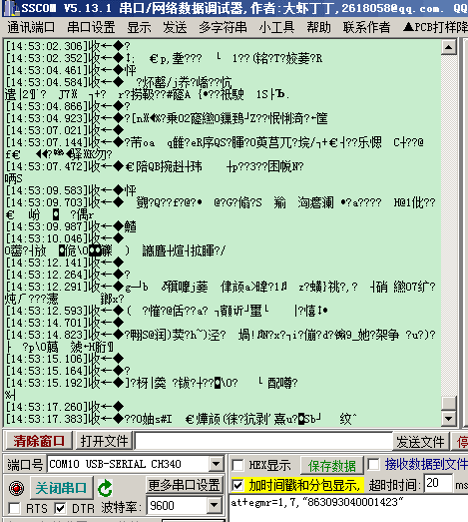

# 开发板

#### 1.开发板存在wifi连接不上的问题，代码上传成功，但就是连接不上？

设备端调用检查检测任务的api接口就可以了。

#### 2.板子购买链接？

开发板可通过OneNET生态商城进行购买。    
标准板：无货    
NB板：[购买链接](https://ecomall.cmcconenet.com/products/detail?goods_id=17)

#### 3.板子购买可以开发票吗？

可以的，在点击购买后，在提交订单页面填写发票信息即可。

#### 4.开发板有带物联卡、NB卡么？

只含开发板及其辅助硬件，不包含物联卡、NB卡。    
物联卡购买可咨询：[咨询链接](http://iot.10086.cn/page/onelink)    
物联卡充值：[充值链接](https://ec.iot.10086.cn/sso/security/login)

#### 5.有开发板资料吗？
有。    
标准板/迷你板：[资料链接](https://open.iot.10086.cn/bbs/thread-863-1-1.html)    
NB板：[资料链接](https://open.iot.10086.cn/bbs/thread-19650-1-1.html)

#### 6.刚到手的开发板，有内置程序吗？

有，开发板背面贴有二维码，扫一扫即可体验。

#### 7.开发板资料、例程代码在哪里下载?

社区->开发板专区，[标准版/迷你版](https://open.iot.10086.cn/bbs/thread-863-1-1.html)，[NB版](https://open.iot.10086.cn/bbs/thread-19650-1-1.html)。

#### 8.开发板通过什么方式下载代码?

标准板通过ST-Link下载代码，Mini板可以通过ST-Link或者USART1下载代码。

#### 9.开发板通过什么方式和平台连接?

WiFi模组和GSM模组。

#### 10.网络模组是内置OneNET协议还是使用通用AT指令？

例程采用软件协议，所以通用AT指令即可，不受网络模组限制。

#### 11.开发板软件开发环境是什么？

Keil MDK、Gcc、IAR都行，例程采用Keil MDK5。

#### 12.下载资料、例程后从哪里开始学习？

对IOT不太熟悉的开发者，可以先从OneNET基础例程学起，逐步熟悉IOT设备端开发流程；在每类例程目录里，有对应的开发资料，在学习之前应先查看该目录里的文档。

#### 13.开发板存在wifi连接不上的问题，代码上传成功，但就是连接不上？

如果是卡在AT+CWJAP这条命令，那就需要把WiFi先设置成STAION模式，或者STATION+AP双模式，设置的具体命令是AT+CWMODE，之后才可以用AT+CWJAP连接WiFi热点。参数可以查阅AT指令文档。因为有些WiFi模块出厂可能没有设置CWMODE，需要手动设置下。

#### 14.标准板的内存有多大？

flash 512。

#### 15.开发板usb转串口用5V还是3.3V的？

3.3V的。

#### 16.标准板上的M5310A模块和M5311模块的AT指令是否兼容？

指令有细微区别，建议对照5310A和5311的AT指令集。

#### 17.想直接移植官方NB开发板的代码，但是我的mcu只有4k内存，可以吗？

NB的demo里面的buf和fifo是为了可靠性设计的，你可以根据你的设备资源进行裁剪。

#### 18.视频开发板的IC是什么？

是GM8136S。

#### 19.标准板可以用0.96的oled屏吗？

可以，iic接口个人接插针。

#### 20.跑M6312历程时串口一直显示这个。是什么问题呢？
 
 
这条命令判断的返回，1,5改成1,1或者1,1改成1,5。

#### 21.我们开发板上面的STM32是多大RAM和ROM的？

ram64，rom512。

#### 22.请问这个标准板V3.1版本是用Keil5 还是Keil5MKD版？

MKD。

#### 23.M5310 NB开发板串口输出一直是乱码，有遇到过的吗，改了9600、115200都是乱码?
 

串口乱码，看看晶振频率与设置的频率和倍频是否一致，波特率，晶振和系统时钟这些核对一下。

#### 24.请问一个问题，想在标准板v3.2板子上加gps模块怎么做？

可以用串口1。

#### 25.标准板的WIFI配置怎么做，现在在公众号里面找不到开发助手了？

在中移OneNET公众号回复配置WiFi，就会推给你。还可以把链接保存下。

#### 26.标准板程序想移植到STM32F103上，可以移植吗？

都是103，改改硬件接口，去除用不到的驱动就可以。