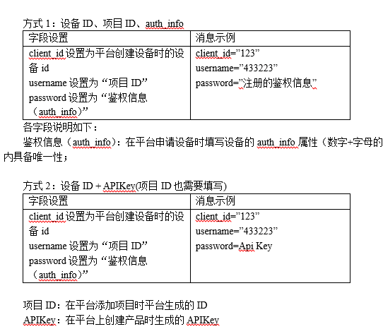

# MQTT套件

#### 1.订阅主题数量有限制么？一个产品下面可发多少topic？一个设备最多能订阅多少个主题？

有限制的，一个MQTT产品下面最多能支持100个自定义topic，一个设备最多能订阅50个主题。

#### 2.应用侧有群发命令给所有设备的API吗？

目前MQTT协议可以变相去实现这个功能，一个产品下MQTT的设备可以订阅相同的topic，达到发布一个topic，订阅了该topic的设备都能收到。

#### 3.透传模式下，Ａ设备怎样传数据到Ｂ设备？

设备之前的通信建议使用MQTT协议来实现。A设备发布主题，B设备订阅该主题。

#### 4.有线网络走mqtt数据协议格式可以吗，用lwip？

可以的，那就用lwipIP里面的socket接口去对接OneNET就可以了。

#### 5.应用侧有群发命令给所有设备的API吗？

目前MQTT协议可以变相去实现这个功能，一个产品下MQTT的设备可以订阅相同的topic，达到发布一个topic，订阅了该topic的设备都能收到。

#### 6.用MQTT协议上传数据在平台上不显示，提示是上传成功的？

只能往topic为$dp的数据流发，OneNET才以数据流的形式展示出来，详见MQTT协议文档。

#### 7.MQTT有没有遗嘱消息？

有的。

#### 8.OneNET是否支持websocket方式的MQTT协议接入？

目前不支持

#### 9.MQTT的一个客户端可以同时订阅多个topic吗？

可以。

#### 10.OneNET平台MQTT第一包数据是publish，不会主动断开套接字吗？

MQTT长连接的，只要你发的数据合法都不会断。

#### 11.MQTT标准的数据流格式是什么？

MQTT有7种数据流格式，详见MQTT开发文档。

#### 12.请问订阅失败是什么原因？怎么解决？

（1）少发了ADDOBJ那条指令；    
（2）对应平台下发的+MIPLOBSERVE没有响应。

#### 13.MQTT Simulate Device是什么软件，起什么作用？

MQTT设备模拟器。

#### 14.OneNET能不能直接当一个MQTT服务器使用，JAVA像访问普通MQTT服务器一样访问OneNET？

可以。java代码只要向访问MQTT服务器那样访问就行了，密码apikey，用户名产品id。

#### 15.OneNET的MQTTs是属于单向认证吗？

不能，但你可以让你的所有设备订阅一个topic，然后往这个topic发数据，需要自行开发，进行群发操作。

#### 16.新版的MQTT套件，生产环境注册码是不是没有了？

没有了，因为新版MQTT每个设备在创建的时候都会分配独立的key用来计算登陆密钥，所以必须先创建设备。

#### 17.测试MQTT接入，提示Broker unavailable是什么原因，是哪个步骤出错了？

建议根据开发文档示例走一次流程，可能是你客户端设备端MQTT版本不对。

#### 18.MQTT c sdk里的keepalive是什么意思？

连接保持时间，就是不进行任何数据交互时的在线保持时间。

#### 19.数据流的gps格式是什么？

MQTT的数据流gps格式 {"datastreams":[{"id":"location","datapoints":[{"value":{"lon":106,"lat":29}}]}]}。

#### 20.MQTT（旧版）和MQTTS（新版）有什么区别？

旧版不带加密，新版带加密，功能上有所区别。旧版和新版都有例程，详见：[https://open.iot.10086.cn/bbs/thread-863-1-1.html](https://open.iot.10086.cn/bbs/thread-863-1-1.html)。

#### 21.请问MQTT里面的proid和auif是什么？

产品id和鉴权信息。

#### 22.MQTT物联网套件可以发送16进制个数的数据吗？

透传的随便发啥都可以，如果为了平台解析必须按格式发。

#### 23.鉴权信息该怎么计算？ 
  

MQTT接入协议里有详细描述：    
  

#### 24.如果使用MQTT的话，需要对接底层的接口函数吗？

是的，主要就是网络那一块。其实只要你的模块能连到平台服务器，按照协议流程进行打包发包就完了，平台本身是不会关心你的通信方式的。

#### 25.MQTT有数据包大小限制吗？

有，但是比较大，远超40k。

#### 26.我们是BC28模块基于MQTT协议的，请问设备可以访问OneNET上的时间吗？

通过api接口，在报文里边有时间，但是很难解析，建议你去ntp服务器直接拿时间。

#### 27.怎么降低MQTT的功耗？

上报了数据就断模组电，然后mcu休眠，这种只适合上报数据，不下发命令的场景。

#### 28.使用MQTT物联网套件走TLS加密，除了CA证书，还需要客户端证书和私钥吗？

不需要。

#### 29.在OneNET平台添加设备后，下载了MQTTFX1.71版本，各种参数都配置好了，但是connect时一直Unable to Connect Server是什么原因？

连不上服务器，应该是ip端口不对。

#### 30.问一下.net如何通过MQTT获取到云上面的数据？

获取不了，只能通过HTTP调用api接口。

#### 31.用模拟器调试MQTT接入OneNET，可以正常注册和上传数据点，但是下发指令时报错： internal error，是不是需要设备端也就是模拟器这边订阅某个主题？

在平台的数据流详情里用模拟数据和下发指令，模拟器只用来做连接测这一步。

#### 32.MQTT批量设备导入提示read excel err zip:not a valid zip file是什么意思？

导入文件格式要对，下载Excel模板。

#### 33.我们有一款-产品，打算产品连接蓝牙网关，网关通过HTTP接入OneNET。请问OneNET平台支持带网关的设备接入吗？

新版MQTT物联网套件支持。

#### 34.OneNET的MQTT不能订阅$开头主题，那就是没办法订阅$creq平台下发命令的主题？那我该怎么获取平台下发的指令？

MQTT默认订阅。

#### 35.nodejs怎么连接MQTT？

接入MQTT的方法和流程详见：[https://open.iot.10086.cn/doc/mqtt/book/example/connect.html](https://open.iot.10086.cn/doc/mqtt/book/example/connect.html)。    
有c语言的sdk，其他语言需要用户自行移植。

#### 36.OneNET平台本身可不可以不做数据的存储只做数据转发？

可以，MQTT自定义topic就只转发不存储。

#### 37.如果我的图片转成bmp二进制格式，通过MQTT协议发送到平台，平台能解析出来吗？

bmp也行，最好jpg的。

#### 38.请问下OneNET平台上MQTT在线的设备数量有api可以查询吗？

你是要查一个数值吗？这个目前没有哦。

#### 39.python使用官方MQTT鉴权证书，提示有错？

可以看下这个python代码怎么放证书的：[https://open.iot.10086.cn/doc/mq/book/develop-manual/demo-proect/python.html](https://open.iot.10086.cn/doc/mq/book/develop-manual/demo-proect/python.html)。

#### 40.请问下MQTT套件里产品信息里的AccessKey和设备信息里的Key有什么区别？

api调用用accesskey，设备登录用key。

#### 41.使用OneNET提供的MQTT fx时一直提示，invalid protocol version是什么原因？

手动选3.1.1,不要default version，具体方法可以参照：[https://open.iot.10086.cn/bbs/thread-38372-1-1.html](https://open.iot.10086.cn/bbs/thread-38372-1-1.html)。

#### 42.MQTT协议上传数据已经可以显示了，但是为什么数据上传一会之后又被平台给关掉了，这是什么原因？

有非法数据就会被踢掉。