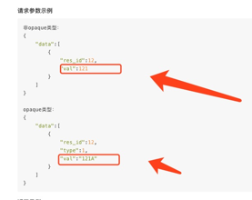

# NB-IoT套件

#### 1.请问在OneNET平台哪里设置res_id？

这个不能设置，在IPSO文档里面。

#### 2.自定义resid有什么要求吗？

流程跟正常一样，差别就是自定义object,instance和resource的ID，只要不与OMA定义的重合就可以。

#### 3.NB产品下IMEI号删除之后显示已重复，不能添加设备？

模组上带的IMEI号只能绑定在唯一的平台设备上，平台不支持重复添加。遇到此问题，建议用户先删除已有设备，若非自己添加，请联系模组提供方删除设备或者更换模组，也可提交申诉。

#### 4.在OneNET平台创建添加设备以后，设备能够上线，但是平台显示设备“该设备不支持发现资源”，这个是怎么回事？

LwM2M协议设备登录OneNET平台，首先需要在订阅Object组和订阅Resource参数，参考使用模组的AT指令先后步骤来完成登录前的配置。

#### 5.为什么设置了可读，结果在平台上看只有设备id是对的，读写权限、数值，数据类型都不对？

不支持自定义让某个对象资源可读可行，平台有自己的规则，参考下IPSO规范的表格。

#### 6.OneNET好多对象的属性(尤其是string类型)的，不识别，显示出都是opaque类型，仅有5750,5751可识别为"string"类型？

按IPSO文档来的就有，如果不按文档，OneNET会把数据当成opaque方式存储和展示。

#### 7.订阅资源里面的对象名称是在代码中改还是在平台上改？

在IPSO文档规定好的，下载文档。

#### 8.资源列表操作里的写怎么改能变成可写的？

IPSO规范里找一个可写的obj，res即可。

#### 9.资源列表里这个灰色的值怎么配置成可用？

这个是IPSO定义的不支持写和执行的，只能通过调用api去写。

#### 10.TIME_OUT OneNET返回给服务器这个是什么错误？

TIME_OUT是因为平台没有在超时时间内（25秒）收到设备的响应，有几种可能：    
（1）网络连接session被核心网回收，NB-IoT设备通过核心网连接到平台，如果设备在一段时间内（各地情况不一，通常为几分钟）没有上行和下行的活动，核心网会回收连接，此时平台下发的消息无法到达设备；    
（2）网络问题，NB-IoT的网络不稳定，尽管CoAP有重传机制，仍然有可能在25秒内无法完成平台到设备的请求响应的全过程。

#### 11.用Onenet平台的LwM2M协议要不要定期给平台发送心跳包？

不用，lifetime里面可以随时发notify上报数据。

#### 12.NB-IoT怎么上报GPS数据？ 

NB支持上报gps的资源。NB轻应用地图使用如下两个资源（任选一个）上传经纬度：    
（1）object id为6，resource id：0（纬度），1（经度）；    
（2）object id为3336，resource id：5513（纬度），5514（经度）。    
在地图中选择对应设备中名为“location”的数据流即可。使用模组M5310-A，资源3336上传经纬度举例：AT+MIPLADDOBJ=0,3336,1,"1",0,1 AT+MIPLDISCOVERRSP=0,3336,1,9,"5513;5514" AT+MIPLNOTIFY=0,0,3336,0,5513,1,13,"100.6474940698",0,1,21 AT+MIPLNOTIFY=0,0,3336,0,5514,1,14,"20.5371754772",0,0,22。

#### 13.NB-IoT连接OneNET后，是一直保持连接呢？还是说过一段时间发送一个心跳包？每次都要进行设备鉴权？

NB设备有生命周期的设置，生命周期内设备在线。设备需要更新生命周期，生命周期可以设置的很长，大于一天。不需要每次都鉴权。

#### 14.M5310只是一个通道，还是集成了LwM2M协议？M5310模组和OneNET平台是coap协议还是LwM2MoverCoap？

5310是集成协议的LwM2MoverCoap的。

#### 15.IMEI和IMSI怎么获取？

获取imsi:at+cimi，获取imei:at+cgsn=1。

#### 16.NB-IoT支持服务器主动控制指令吗？

支持的，api接口下行读写执行都是服务器主动控制设备的命令。

#### 17.OneNET平台NB下发指令是字符串类型吗？

可以，用执行execute的接口，下发字符串。

#### 18.NB-IoT协议创建设备的时候，正式设备和测试设备有什么区别？

测试设备是模拟的，正式设备是真实的nb模块。测试设备IMEI可以随便写 正式设备会验证IMEI。

#### 19.设备订阅功能是什么意思？

LMW2M协议的订阅是上报数据点NOTIFY的前提，只有订阅了才可以上报数据。

#### 20.LwM2M自定义对象资源如何定义？

资源规范定义了OBJ_ID,RESOURCE_ID。然后每个对象资源是有相应的数据类型，举个例子，如果你想上传16进制的数据，可以选择3200-0-5505。

#### 21.LwM2M连OneNET可以不用资源号，直接传hex吗？

不行。

#### 22.收到NB发的数据后能不能设置自动回复数据到设备，我用什么判断发送成功到平台了呢？

NOTIFY指令有个ACKID，通过使用这个参数，平台回复，可以看下指令手册。

#### 23.用LwM2M协议，设备往平台发送数据信息时，平台会自动重新更新lifetime吗？还是得发送Update报文才会更新？

不会哦，只有发Update报文才会更新。

#### 24.设备的订阅状态为什么在离线之后就变成false？

NB设备注册和离线时会删除订阅，如果Update报文中删除了资源，平台也会移除订阅。

#### 25.使用NB协议连接平台第一次上电走连接流程的时候数据可以正常在平台上面显示，但是在唤醒之后直接发数据，模组连接成功了，但是平台没有更新，看不到数据，是为什么？是否跟平台有关系？

最好带上ackid，模组notify发出去返回的OK，是模组指令正确，不一定一定发送成功。

#### 26.LwM2M协议obj_inst_id和res_id这两个id是指什么id啊？

比如 AT+MIPLNOTIFY=0,0,3200,0,5750,1,3,"123",0,0。obj_inst_id为0，res_id为5750。

#### 27.LwM2M应用端不能查询所有设备吗？LwM2M应用端有没有接口一下能获取所有该产品下面的设备？

入参要deviceid 。多个查询用,号隔开。

#### 28.请问NB一次最多能发送/接收多少数据？

平台没做限制。很多模组限制的1000byte。具体限制多少字节需要问模组厂商，超过限制的长度，模组会分包的。

#### 29.调用创建设备接口，返回结果{"errno":6,"error":"invalid parameter: auth_info"}，怎么设置这个参数呢？

可能是你的imei不符合规则，必须填写模组真实的imei号。

#### 30.请问LwM2M协议，需要在OneNET上对终端实现observe后，终端执行notify，OneNET才能收到是吗？

对，必须先完成相关对象的订阅，才可以往改对象进行notify。

#### 31.LwM2M协议中obj_inst_id,res_id，两个id是指哪个id？

这个问题以举例子比较好理解，例如AT+MIPLNOTIFY=0,0,3200,0,5750,1,0,"hello word",0,0,50 那么obj_inst_id是0，res_id是5750。

#### 32.NB模块LwM2M协议发送数据到移动OneNET平台限制数据为多少长度？

数据限制长度为4KB。

#### 33.OneNET平台是否支持通用UDP网络？

OneNET不支持UDP协议，支持LwM2M协议。

#### 34.请问NB在两分钟没数据上传后平台是否无法下发数据呢？

NB下发命令需在设备主动上报数据后1分钟内下发，设备才可以收到命令，并且需要设备主动回复响应，才不会提示超时。

#### 35.NB按次连接是啥意思，比如我长连接，一直发心跳包，每次发送就是一次？

IPV4的ip有限，设备上传了数据，基站1分钟左右会回收设备ip，导致下发命令api找不到设备，于是命令会导致设备超时。

#### 36.为什么NB协议一连上设备就能够收到之前调用API下发的命令吗？是什么原理？

离线缓存命令，看官网-开发文档-NB-IoT套件-应用开发文档里面，有个东西叫系统主题。下发命令用的是系统主题，默认你已经订阅了。

#### 37.怎么查看附近的NB信号强度？

查NB信号方式：（1）买专门的信号探测器；（2）用个模组发at指令去查，AT+CSQ。

#### 38.请问下LwM2M协议设备接入平台后向平台发送数据，平台是否会自动发个回复给设备吗？

有没有回复看你上报数据时选择的格式，上报时在ACK位填入非零的报文序列号，平台会分别一一按序列号回复的。

#### 39.NB模块，设置AT+MIPLOPEN=0,300,60\r\n，将模块断电，过了10分钟后，onenet平台上显示设备仍然在线。怎么操作才能让断电设备在平台上显示离线？

你更新查询下日志，是否又用update指令去更新了lifetime。NB设备断电就显示离线，需要断电前发起注销登录报文，对应AT指令是AT+MIPLCLOSE那个。

#### 40.请问LwM2M与CoAP有什么区别，我找不到有关CoAP的产品。

可以看下这个帖子的解释：[https://open.iot.10086.cn/bbs/thread-23808-1-1.html](https://open.iot.10086.cn/bbs/thread-23808-1-1.html)。目前Studio已经支持CoAP。

#### 41.OneNET平台下发到设备上的字符串变成了十六进制格式，这个可能是什么原因？

LwM2M所写的值只有在该资源类型被申明(notify或read)过后才能正确识别。下发写入未声明过类型的值是一种错误用法，务必注意。

#### 42.NB-loT物联网套件的缓存命令-写设备资源下的val填的是什么？
  
 
val是要下发的数据。

#### 43.OneNET的LwM2M可以自定义的Object嘛？还是只能用预设定的？

可以自定义，OneNET可以支持自定义objid，自定义就是模组AT指令里面改就可以了。例如 AT+MIPLADDOBJ=0,6666,1,"1",0,1 AT+MIPLDISCOVERRSP=0,6666,1,4,"1000"。

#### 44.LwM2M协议的话能走透传吗？

可以。可以选两个资源，一个上报，一个下发。分别是3200_0_5505 3200_1_5505三个数字从左到右是objid_insid_resid。这两个资源的数据类型是16进制字符串。针对上报就用3200_0_5505，硬件往里面封装数据，数据牵扯到协议，软硬件一起定。硬件封装好上报到OneNET，OneNET推送到应用平台他来解析。针对下发就用3200_1_5505，应用平台往里面封装数据，也要定协议。应用平台封装好下发到到OneNET，OneNET转发到设备、设备解析执行。

#### 45.NB协议点击“写”填入数据，网页卡住10几秒，然后提示error：unsuccess:time_out，是什么原因？

需要设备上报数据了再点写，设备才能收到。

#### 46.平台下发的NBACC_AUTO_READ是哪里来的？

平台下发的，LwM2M协议设备登录的时候，平台会自动下发，表示读取设备版本号的意思，和开发者业务逻辑无关，可以不管。

#### 47.资源ID的名称支持自定义吗？

（1）LwM2M协议规定了一些IPSO，ipso对应一些objid resid，例如3200 5750；    
（2）OneNET可以支持自定义objid，自定义就是模组AT指令里面改就可以了，例如AT+MIPLADDOBJ=0,1234,1,"1",0,1 AT+MIPLDISCOVERRSP=0,1234,1,4,"2345" ，这样就自定义了objid为1234 resid为2345；    
（3）自定义的id，页面读写执行是灰色的，但是api是可以操作的。例如我执行下发命令：[http://api.heclouds.com/nbiot/execute?imei=869976030070537&obj_id=1234&obj_inst_id=0&res_id=2345](http://api.heclouds.com/nbiot/execute?imei=869976030070537&obj_id=1234&obj_inst_id=0&res_id=2345)；    
（4）自定义或者不自定义实际上无关紧要。自定义，范围在2000-10000之间，8000个id可以选；    
（5）不要选择objid为27516这些，我记得27516是，IPSO规定了用来表示某特征的。反正在2000-10000肯定IPSO没有被征用；    
（6）自定义的objid resid，数据类型是opaque类型。